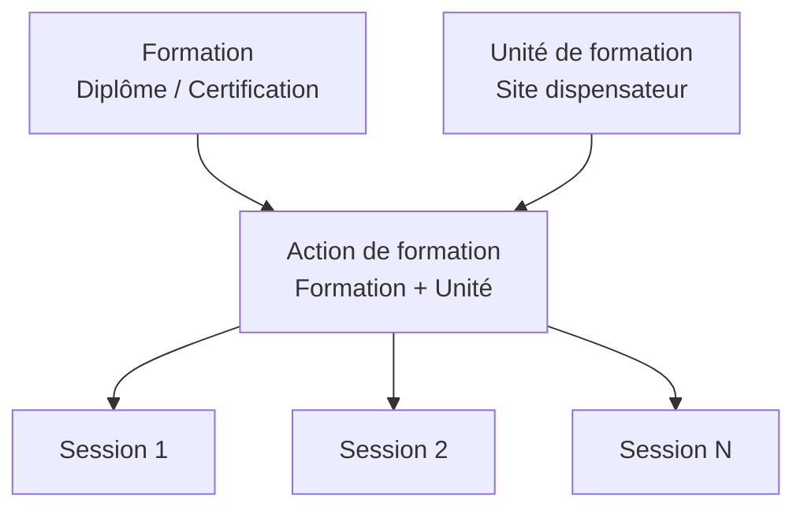

# Introduction aux actions de formation

## Qu'est-ce qu'une action de formation ?

Une **action de formation** est le niveau intermédiaire entre la formation (catalogue) et la session (programmation). Elle représente une formation spécifique dispensée par une unité de formation donnée.

## Position dans la hiérarchie

L'action de formation fait le lien entre :
- La **formation** : le diplôme ou la certification du catalogue
- L'**unité de formation** : le site qui dispense cette formation

## Pourquoi ce niveau intermédiaire ?

L'action de formation permet de :

- **Adapter la formation** aux spécificités d'un site
- **Paramétrer** des modalités pédagogiques propres
- **Regrouper** les sessions d'une même formation sur un même site
- **Suivre** les indicateurs par site de formation

## Public concerné

Cette documentation s'adresse aux :

- **Responsables pédagogiques** : création et suivi des actions
- **Administrateurs de centre** : approbation des actions
- **Gestionnaires de formation** : utilisation quotidienne

## Fonctionnalités principales

| Fonctionnalité | Description |
|----------------|-------------|
| **Création** | Rattacher une formation à une unité |
| **Consultation** | Voir le détail et les sessions associées |
| **Modification** | Mettre à jour les paramètres |
| **Approbation** | Valider l'action avant utilisation |
| **Sessions** | Créer des sessions depuis l'action |

---

## Pour aller plus loin

-> [02 - Concepts clés](02-concepts-cles)
