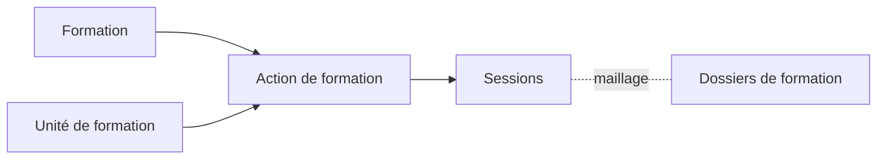

# Concepts clés

## Définitions

### Action de formation

Une **action de formation** est l'association d'une formation (diplôme/certification) avec une unité de formation (site dispensateur). Elle représente la capacité d'un site à dispenser une formation spécifique.

### Relation avec les autres entités

## Éléments constitutifs

Une action de formation comprend :

| Élément | Description |
|---------|-------------|
| **Formation** | La certification ou le diplôme du catalogue |
| **Unité de formation** | Le site qui dispense la formation |
| **Lieux de formation** | Lieu principal et lieux secondaires |
| **Sessions** | Les périodes programmées |

## Lieux de formation

### Héritage depuis l'unité de formation

Lors de la création d'une action de formation, les **lieux de formation** sont hérités de l'unité de formation :

- Le **lieu principal** de l'unité devient le lieu principal de l'action
- Les **lieux secondaires** de l'unité sont également récupérés

### Personnalisation possible

Les lieux de formation peuvent être **modifiés** au niveau de l'action de formation :

- Changer le lieu principal
- Ajouter ou retirer des lieux secondaires
- Adapter aux spécificités de la formation dispensée

Cette flexibilité permet d'avoir des lieux différents selon les formations, même au sein d'une même unité.

## Unicité

Une action de formation est **unique** pour le triplet :

> **Formation + Unité de formation + Durée de l'action**

### Durée de l'action de formation

- La **durée de l'action** est un attribut propre à l'action de formation
- Par défaut, elle est pré-initialisée à partir de la durée théorique de la formation
- Elle permet de créer plusieurs variantes d'une même formation au sein d'une même unité

### Exemple

Pour une formation **RNCP10000** (durée théorique 36 mois) dans une même unité de formation :

| Action | Durée | Statut |
|--------|-------|--------|
| Action A | 36 mois | ✅ Autorisée |
| Action B | 24 mois | ✅ Autorisée (durée différente) |
| Action C | 36 mois | ❌ Refusée (même triplet que A) |

### Message d'erreur

Si vous tentez de créer une action avec un triplet déjà existant, le message suivant s'affiche :

> "Une action de formation existe déjà pour cette formation, cette unité de formation et cette durée."

## Cas d'usage

### Exemple concret

**Unité de formation** : Lycée Professionnel Jean Moulin (UAI 0750001A)
- Lieu principal : 15 avenue de la République, 75011 Paris
- Lieu secondaire : Annexe Voltaire, 75020 Paris

**Action de formation** : BTS Comptabilité et Gestion dispensé par le Lycée Jean Moulin
- Lieu principal : Annexe Voltaire, 75020 Paris *(était secondaire au niveau de l'unité)*
- Lieu secondaire : 15 avenue de la République, 75011 Paris *(était principal au niveau de l'unité)*

Dans cet exemple, les lieux sont les mêmes que ceux de l'unité, mais les catégories ont été inversées car le BTS CG est principalement dispensé à l'annexe Voltaire.

Cette action permet ensuite de créer des sessions :
- Session Septembre 2024 - Juin 2026
- Session Septembre 2025 - Juin 2027

---

## Pour aller plus loin

-> [03 - Accéder à la gestion des actions](03-acceder-gestion-actions)
