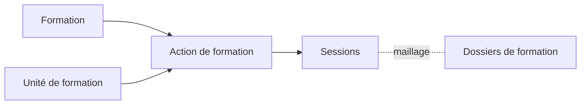

# Concepts clés

## Définitions

### Action de formation

Une **action de formation** est l'association d'une formation (diplôme/certification) avec une unité de formation (site dispensateur). Elle représente la capacité d'un site à dispenser une formation spécifique.

### Relation avec les autres entités

## Éléments constitutifs

Une action de formation comprend :

| Élément | Description |
|---------|-------------|
| **Formation** | La certification ou le diplôme du catalogue |
| **Unité de formation** | Le site qui dispense la formation |
| **Lieux de formation** | Lieu principal et lieux secondaires |
| **Sessions** | Les périodes programmées |

## Lieux de formation

### Héritage depuis l'unité de formation

Lors de la création d'une action de formation, les **lieux de formation** sont hérités de l'unité de formation :

- Le **lieu principal** de l'unité devient le lieu principal de l'action
- Les **lieux secondaires** de l'unité sont également récupérés

### Personnalisation possible

Les lieux de formation peuvent être **modifiés** au niveau de l'action de formation :

- Changer le lieu principal
- Ajouter ou retirer des lieux secondaires
- Adapter aux spécificités de la formation dispensée

Cette flexibilité permet d'avoir des lieux différents selon les formations, même au sein d'une même unité.

## Unicité

Une action de formation est **unique** pour un couple Formation + Unité de formation. Il ne peut pas y avoir deux actions de formation identiques pour le même site et la même formation.

## Cas d'usage

### Exemple concret

- **Formation** : BTS Comptabilité et Gestion (RNCP 38364)
- **Unité de formation** : CFA Paris Centre
- **Action de formation** : BTS CG dispensé par le CFA Paris Centre
  - Lieu principal : 12 rue de la Formation, 75001 Paris
  - Lieu secondaire : Annexe Bercy, 75012 Paris

Cette action permet ensuite de créer des sessions :
- Session Septembre 2024 - Juin 2026
- Session Septembre 2025 - Juin 2027

---

## Pour aller plus loin

-> [03 - Accéder à la gestion des actions](03-acceder-gestion-actions)
