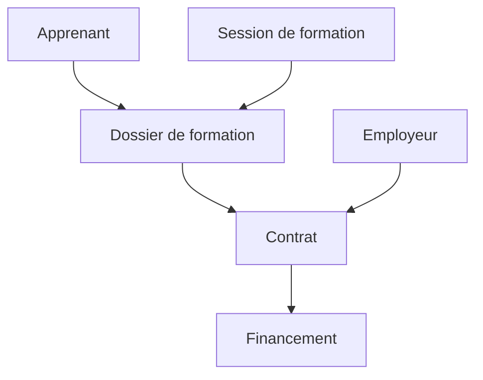

## Concepts fondamentaux

### Contrat d'apprentissage

Le contrat d'apprentissage est un contrat de travail à durée déterminée (CDD) ou indéterminée (CDI) conclu entre un employeur et un apprenti. Il permet à l'apprenti de suivre une formation en alternance, combinant enseignement théorique en CFA et pratique professionnelle en entreprise.

Dans Papaours, un contrat est caractérisé par :

- **Référence** : Identifiant unique auto-généré (format : CA + année + numéro séquentiel, ex: CA2026-000057)
- **Version** : Numéro de version du format CERFA utilisé (ex: Version 14)
- **État** : Statut actuel du contrat (En cours, Signé, Rompu)
- **Période** : Dates de début et de fin d'exécution du contrat
- **Rémunération** : Grille de salaire par année d'apprentissage

### Brouillon de contrat

Un brouillon est un contrat en cours de création qui n'a pas encore été validé. Il permet de saisir progressivement les informations sans contrainte de complétude immédiate.

Un brouillon est caractérisé par :

- **Référence** : Identifiant unique commençant par BCA (Brouillon Contrat Apprentissage)
- **Taux de complétion** : Pourcentage indiquant l'avancement de la saisie (20%, 40%, 60%, 80%, 100%)
- **Étapes** : Parcours guidé de saisie (Employeur, Contrat, Situation apprenti)

### CERFA

Le CERFA (Centre d'Enregistrement et de Révision des Formulaires Administratifs) est le formulaire officiel de déclaration du contrat d'apprentissage. Dans Papaours, le CERFA est généré automatiquement lors de la validation d'un brouillon de contrat.

### États du contrat

Un contrat passe par différents états au cours de son cycle de vie :

| État | Description |
|------|-------------|
| **Brouillon** | Contrat en cours de création |
| **À signer** | Contrat validé, en attente de signature |
| **Signé** | Contrat signé par toutes les parties |
| **En cours** | Contrat actif, apprentissage en cours d'exécution |
| **Terminé** | Contrat achevé normalement à son terme |
| **Rompu** | Contrat résilié avant son terme (après démarrage) |
| **Annulé** | Contrat annulé avant son démarrage |

---

## Relations avec les autres modules

Le contrat d'apprentissage fait le lien entre un **dossier de formation** et un **employeur** :

- **Dossier de formation** : Porte l'apprenant et la session de formation
- **Apprenant** : Personne physique inscrite au dossier de formation
- **Session de formation** : Période de formation rattachée au dossier
- **Contrat** : Lie le dossier de formation à l'employeur
- **Employeur** : Entreprise qui embauche l'apprenti
- **Financement** : Prise en charge financière par l'OPCO

---

## Pour aller plus loin

Poursuivez avec la page suivante :
[03 - Accéder à la gestion des contrats](03-acceder-gestion-contrats)
