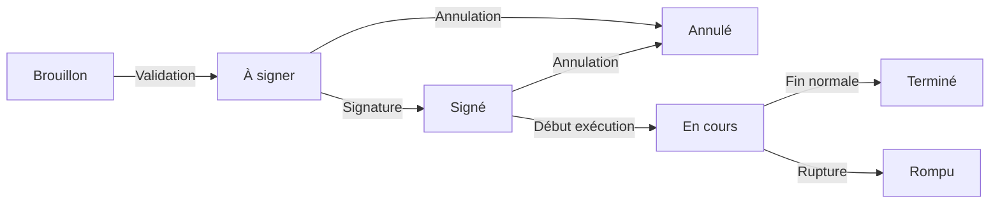

## Les états d'un contrat

Un contrat d'apprentissage passe par différents états au cours de son cycle de vie, depuis sa création jusqu'à sa fin.

### États possibles

| État | Description |
|------|-------------|
| **Brouillon** | Contrat en cours de création, informations incomplètes |
| **À signer** | Contrat validé, en attente de signature des parties |
| **Signé** | Le contrat a été signé par toutes les parties |
| **En cours** | Le contrat est actif, l'apprentissage est en cours d'exécution |
| **Terminé** | Le contrat s'est terminé normalement à son terme |
| **Rompu** | Le contrat a été résilié avant son terme (contrat démarré) |
| **Annulé** | Le contrat a été annulé (avant démarrage) |

---

## Cycle de vie d'un contrat

### Passage de Brouillon à À signer

Ce passage se fait lors de la **validation du brouillon**. Le contrat passe en attente de signature par les différentes parties (employeur, apprenti, représentant légal si applicable).

### Passage à Signé

L'état "Signé" indique que le contrat a été signé par toutes les parties requises.

Ce passage peut se faire :
- Automatiquement après une signature électronique complète
- Manuellement après signature papier

### Passage à En cours

Une fois signé, le contrat passe à l'état "En cours" lorsque la période d'exécution du contrat débute (date de début du contrat atteinte).

### Passage à Terminé

L'état "Terminé" indique que le contrat s'est achevé normalement à la date de fin prévue, avec obtention ou non du diplôme.

### Passage à Rompu

L'état "Rompu" indique que le contrat a été résilié avant son terme. Cela peut survenir pour diverses raisons :
- Rupture d'un commun accord
- Rupture pendant la période d'essai
- Licenciement
- Démission
- Obtention anticipée du diplôme

---

## Actions sur les états

### Annuler un contrat

Le bouton **Annuler** permet d'annuler un contrat **qui n'a pas encore démarré** (état "À signer" ou "Signé" avant la date de début) :

1. Accédez à la fiche du contrat
2. Cliquez sur **Annuler**
3. Confirmez l'action
4. Le contrat passe à l'état "Annulé"

Cette action est utilisée lorsque le contrat ne va finalement pas être exécuté (changement de situation, erreur, etc.).

### Rompre un contrat

Le bouton **Rompre** permet de mettre fin à un contrat **en cours d'exécution** :

1. Accédez à la fiche du contrat (état "En cours")
2. Cliquez sur **Rompre**
3. Renseignez le motif de rupture
4. Confirmez l'action
5. Le contrat passe à l'état "Rompu"

**Important** : Un contrat ne peut être rompu que s'il a démarré (état "En cours"). Avant le démarrage, utilisez "Annuler".

### Revenir en brouillon

Le bouton **Revenir en brouillon** permet de transformer un contrat validé en brouillon pour effectuer des modifications importantes :

1. Accédez à la fiche du contrat
2. Cliquez sur **Revenir en brouillon**
3. Le contrat disparaît de la liste des contrats validés
4. Il réapparaît dans la liste des brouillons
5. Vous pouvez alors le modifier et le revalider

Cette action est utile en cas d'erreur de saisie ou de modification majeure nécessaire.

---

## Impact des états sur les actions

Selon l'état du contrat, certaines actions peuvent être disponibles ou non :

| Action | À signer | Signé | En cours | Terminé | Rompu | Annulé |
|--------|----------|-------|----------|---------|-------|--------|
| Voir | Oui | Oui | Oui | Oui | Oui | Oui |
| Financer | Oui | Oui | Oui | Non | Non | Non |
| Revenir en brouillon | Oui | Oui | Non | Non | Non | Non |
| Annuler | Oui | Oui | Non | Non | Non | Non |
| Rompre | Non | Non | Oui | Non | Non | Non |

---

## Historique des changements d'état

Tous les changements d'état sont tracés dans l'historique du contrat :

- Date et heure du changement
- Utilisateur ayant effectué l'action
- État précédent et nouvel état

Cette traçabilité est essentielle pour le suivi réglementaire et les audits.

---

## Pour aller plus loin

Poursuivez avec la page suivante :
[08 - Financer un contrat](08-financer-contrat)
