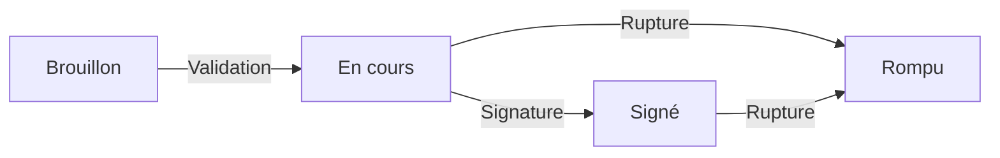

## Les états d'un contrat

Un contrat d'apprentissage validé peut passer par différents états au cours de son cycle de vie.

### États possibles

| État | Description | Badge |
|------|-------------|-------|
| **En cours** | Le contrat est actif, l'apprentissage est en cours | Bleu |
| **Signé** | Le contrat a été signé par toutes les parties | Vert |
| **Rompu** | Le contrat a été résilié avant son terme normal | Rouge |

---

## Cycle de vie d'un contrat

### Passage de Brouillon à En cours

Ce passage se fait automatiquement lors de la **validation du brouillon**. Le contrat est créé avec l'état "En cours".

### Passage à Signé

L'état "Signé" indique que le contrat a été signé par toutes les parties (employeur, apprenti, et éventuellement représentant légal).

Ce passage peut se faire :
- Manuellement par mise à jour de l'état
- Automatiquement après une signature électronique complète

### Passage à Rompu

L'état "Rompu" indique que le contrat a été résilié avant son terme. Cela peut survenir pour diverses raisons :
- Rupture d'un commun accord
- Rupture pendant la période d'essai
- Licenciement
- Démission
- Obtention du diplôme avant le terme

---

## Actions sur les états

### Annuler un contrat

Le bouton **Annuler** permet de marquer un contrat comme rompu :

1. Accédez à la fiche du contrat
2. Cliquez sur **Annuler**
3. Confirmez l'action

Cette action est tracée dans l'historique du contrat.

### Revenir en brouillon

Le bouton **Revenir en brouillon** permet de transformer un contrat validé en brouillon pour effectuer des modifications importantes :

1. Accédez à la fiche du contrat
2. Cliquez sur **Revenir en brouillon**
3. Le contrat disparaît de la liste des contrats validés
4. Il réapparaît dans la liste des brouillons
5. Vous pouvez alors le modifier et le revalider

Cette action est utile en cas d'erreur de saisie ou de modification majeure nécessaire.

---

## Impact des états sur les actions

Selon l'état du contrat, certaines actions peuvent être indisponibles :

| Action | En cours | Signé | Rompu |
|--------|----------|-------|-------|
| Voir | Oui | Oui | Oui |
| Financer | Oui | Oui | Non |
| Revenir en brouillon | Oui | Oui | Oui |
| Annuler | Oui | Oui | Non |
| Supprimer | Selon droits | Selon droits | Selon droits |

---

## Historique des changements d'état

Tous les changements d'état sont tracés dans l'historique du contrat :

- Date et heure du changement
- Utilisateur ayant effectué l'action
- État précédent et nouvel état

Cette traçabilité est essentielle pour le suivi réglementaire et les audits.

---

## Pour aller plus loin

Poursuivez avec la page suivante :
[08 - Financer un contrat](08-financer-contrat)
