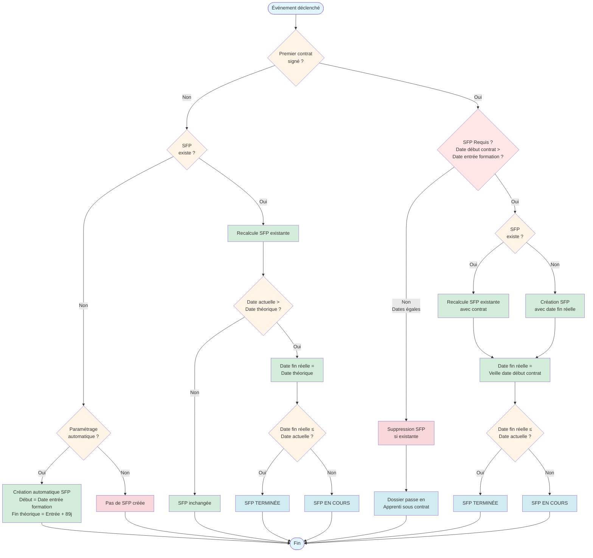

# Fonctionnement des SFP avant contrat

## Qu'est-ce qu'une SFP avant contrat ?

Une **SFP avant contrat (Stagiaire de la Formation Professionnelle avant contrat)** est une période transitoire durant laquelle un apprenant est inscrit à une formation mais n'a pas encore signé de contrat d'apprentissage.

Cette période permet à l'apprenant de :
- Commencer sa formation avant la signature du contrat
- Être couvert administrativement pendant la recherche d'un employeur
- Bénéficier d'un statut officiel pendant la période précédant le contrat d'apprentissage

**Durée maximale** : Une période SFP avant contrat peut durer jusqu'à **89 jours**.

---

## Diagramme de gestion des SFP avant contrat

Le diagramme ci-dessous illustre les règles de calcul et de gestion des périodes SFP avant contrat dans Papaours :

**Points clés du diagramme** :
- Une SFP avant contrat est **terminée** uniquement si sa **date de fin réelle existe** ET qu'elle est **inférieure ou égale à la date actuelle**
- La signature d'un contrat **définit la date de fin réelle** de la SFP avant contrat mais ne la termine pas automatiquement
- Le système vérifie quotidiennement si les SFP avant contrat doivent être terminées en comparant la date actuelle avec la date de fin réelle
- **Cas particulier** : Si la date de début d'exécution du contrat est **égale** à la date d'entrée en formation, **aucune SFP avant contrat n'est nécessaire** et sera supprimée si elle existe

**Événements déclencheurs** :
- Signature d'un contrat (définit la date de fin réelle)
- Inscription d'un apprenant
- Recalcul automatique quotidien (termine les SFP avant contrat dont la date de fin réelle est dépassée)
- Déclaration manuelle d'une SFP avant contrat

---

## Quand créer une SFP avant contrat ?

### Conditions pour créer une SFP avant contrat

Vous pouvez créer une période SFP avant contrat manuellement lorsque :
- ✅ L'apprenant est **inscrit à une session de formation**
- ✅ **Aucun contrat n'a été signé** avant la date d'entrée en formation
- ✅ Le dossier est dans l'état **"Inscrit à la formation"**

Vous **ne pouvez pas** créer une SFP avant contrat si :
- ❌ Un contrat est déjà signé sur le dossier
- ❌ Une période SFP avant contrat existe déjà (non annulée)
- ❌ L'inscription a été annulée

---

## Comment créer une SFP avant contrat ?

Papaours propose deux modes de création des périodes SFP avant contrat : **manuel** et **automatique**.

### Mode manuel

Dans ce mode, vous décidez explicitement quand déclarer un apprenant en SFP avant contrat.

**Procédure** :
1. Accédez au dossier de formation de l'apprenant
2. Cliquez sur le bouton **"Déclarer en SFP avant contrat"**
3. La période SFP avant contrat est créée immédiatement avec :
    - **Date de début** : Date d'entrée en formation de l'apprenant
    - **Date de fin théorique** : Date de début + 89 jours
    - **Statut** : Le dossier passe automatiquement en état **"SFP avant contrat"**

### Mode automatique

Dans ce mode, le système crée automatiquement une période SFP avant contrat selon vos paramètres.

**Configuration** :
1. Accédez à **Paramètres > Dossiers de formation**
2. Dans la section **"Paramètres SFP avant contrat"** :
    - Sélectionnez le mode **"Automatique"**
    - Définissez le **délai en jours** avant la création automatique

**Fonctionnement** :
- Le système vérifie quotidiennement les dossiers de formation qui ont besoin d'une SFP avant contrat
- Si le délai configuré est écoulé depuis la date d'entrée en formation, une SFP avant contrat est créée automatiquement
- Exemple : Avec un délai de 3 jours, si un apprenant entre en formation le 1er janvier, la SFP avant contrat sera créée automatiquement le 4 janvier

---

## Statuts des SFP avant contrat

Une période SFP avant contrat peut avoir **4 statuts différents** :

### 1. À venir
- La date de début de la SFP avant contrat n'est pas encore atteinte
- La période est planifiée mais pas encore active

### 2. En cours
- La date actuelle est comprise entre la date de début et la date de fin théorique
- La période SFP avant contrat est active
- L'apprenant bénéficie du statut de stagiaire de la formation professionnelle avant contrat
- **Important** : Une SFP avant contrat reste "En cours" même si un contrat est signé, tant que la date de fin réelle n'est pas dépassée

### 3. Terminée
- Une **date de fin réelle** existe ET cette date est **dans le passé** (inférieure ou égale à la date actuelle)
- La période SFP avant contrat a pris fin
- **Cas de terminaison** :
    - Lorsque la date de fin théorique est atteinte (89 jours après le début)
    - Lorsqu'un contrat est signé ET que la veille de sa date de début d'exécution est atteinte
    - Lorsqu'une date de fin réelle manuelle est définie et dépassée

### 4. Annulée
- La période SFP avant contrat a été annulée manuellement
- Elle n'est plus active et ne peut plus être utilisée

---

## Actions sur un dossier en SFP avant contrat

Lorsqu'un dossier est dans l'état **"SFP avant contrat"**, vous pouvez effectuer les actions suivantes :

### Sur le dossier de formation

**Actions disponibles** :
- 📋 **Créer un contrat ou brouillon** : Préparer le futur contrat d'apprentissage
- ❌ **Annuler l'inscription** : Possible tant qu'aucun contrat ou financement n'est engagé

### Sur la période SFP avant contrat

**Actions disponibles** :
- 🔍 **Consulter les dates** : Voir la date de début, date de fin théorique et réelle, statut
- 📑 **Générer le formulaire CERFA P2S** : Créer le document pré-rempli (stocké automatiquement dans les documents du dossier)
- ❌ **Annuler la période SFP avant contrat** : Mettre fin à la période SFP avant contrat (voir conditions ci-dessous)

---

## Annuler une période SFP avant contrat

### Quand peut-on annuler une SFP avant contrat ?

Vous pouvez annuler une période SFP avant contrat si :
- ✅ La période est **"À venir"** ou **"En cours"**

Vous **ne pouvez pas** annuler une SFP avant contrat si :
- ❌ Elle est déjà **terminée**
- ❌ Elle est déjà **annulée**

### Comment annuler une SFP avant contrat ?

**Procédure** :
1. Accédez au dossier de formation
2. Dans la section **"SFP avant contrat"**
3. Cliquez sur **"Annuler la période SFP avant contrat"**
4. Confirmez l'annulation

**Effet** :
- La période SFP avant contrat passe au statut **"Annulée"**
- Le dossier revient à l'état **"Inscrit à la formation"**
- Une nouvelle SFP avant contrat pourra être créée si nécessaire

---

## Impact de la signature d'un contrat

Lorsqu'un contrat est signé sur un dossier de formation, plusieurs événements se produisent automatiquement :

### Définition de la date de fin réelle

**Cas particulier : Dates identiques**

Si la **date de début d'exécution du contrat** est **égale** à la **date d'entrée en formation** :
- **Aucune SFP avant contrat n'est requise** (l'apprenant n'a pas eu de période sans contrat)
- Si une SFP avant contrat existe, elle est **automatiquement supprimée**
- Le dossier passe directement à l'état **"Apprenti sous contrat"**
- Exemple : Apprenant entre en formation le 1er septembre et le contrat débute le 1er septembre → Pas de SFP avant contrat

**Si une SFP avant contrat existe déjà** :
- La **date de fin réelle** est fixée à la **veille de la date de début d'exécution du contrat**
- La SFP avant contrat **ne passe pas immédiatement au statut "Terminée"**
- Elle sera automatiquement terminée lors du prochain recalcul quotidien si la date de fin réelle est dépassée
- Exemple : Si le contrat débute le 15 janvier et qu'on signe le 10 janvier, la date de fin réelle est fixée au 14 janvier, mais la SFP avant contrat ne sera terminée qu'à partir du 15 janvier

**Si aucune SFP avant contrat n'existe** :
- Le système crée automatiquement une SFP avant contrat avec :
    - Date de début = Date d'entrée en formation
    - Date de fin réelle = Veille de la date de début d'exécution du contrat
- Si la date de fin réelle est déjà dépassée, la SFP avant contrat sera créée avec le statut "Terminée"
- Cela permet de garder une traçabilité complète du parcours de l'apprenant

### Changement d'état du dossier

- Le dossier passe de **"Inscrit à la formation"** ou **"SFP avant contrat"** à **"Apprenti sous contrat"**
- Les actions disponibles changent en conséquence
- La période SFP avant contrat reste consultable dans l'historique

---

## Paramétrage automatique

Le paramétrage de la création automatique des SFP avant contrat se fait au niveau du centre de formation.

### Accès aux paramètres

1. Dans le menu principal, accédez à **Paramètres**
2. Sélectionnez **Dossiers de formation**
3. Section **"Paramètres SFP avant contrat"**

### Options disponibles

**Mode de déclenchement** :
- **Manuel** : Vous devez créer les SFP avant contrat manuellement pour chaque dossier
- **Automatique** : Le système crée les SFP avant contrat selon le délai configuré

**Délai en jours** (mode automatique uniquement) :
- Nombre de jours après la date d'entrée en formation avant création automatique
- Recommandation : Entre 3 et 7 jours
- Exemple de configurations courantes :
    - **3 jours** : Création rapide pour débuter la formation rapidement
    - **7 jours** : Laisser plus de temps pour la signature du contrat avant création de la SFP avant contrat

### Recalcul automatique

Le système effectue des recalculs automatiques quotidiens pour :
- Créer les SFP avant contrat en mode automatique quand le délai est atteint
- Définir la date de fin réelle des SFP avant contrat quand la date théorique est dépassée
- Terminer les SFP avant contrat dont la date de fin réelle est dépassée par rapport à la date actuelle
- Mettre à jour l'état des dossiers en conséquence

---

## Génération du formulaire CERFA P2S

Le **formulaire CERFA P2S** est un document administratif officiel requis pour les stagiaires de la formation professionnelle avant contrat.

### Qu'est-ce que le P2S ?

Le P2S est un formulaire pré-rempli qui documente la période de stage de formation professionnelle avant contrat. Il contient :
- Les informations de l'apprenant
- Les détails de la formation
- Les dates de la période SFP avant contrat
- Les informations du centre de formation

### Comment générer le P2S ?

**Conditions** :
- Le dossier doit être en état **"SFP avant contrat"**
- Vous devez avoir les droits d'écriture sur les documents du dossier

**Procédure** :
1. Ouvrez le dossier de formation
2. Cliquez sur **"Générer Cerfa P2S"**
3. Le document est automatiquement :
    - Généré au format PDF
    - Pré-rempli avec les données du dossier
    - Stocké dans les **documents du dossier de formation**

**Accès au document** :
- Consultez l'onglet **"Documents"** du dossier
- Le P2S est disponible au téléchargement

---

## Récapitulatif des règles métier

### Création d'une SFP avant contrat

| Condition                                         | Création possible                          |
|---------------------------------------------------|--------------------------------------------|
| Dossier "Inscrit à la formation" + Aucun contrat | ✅ Oui                                      |
| Dossier avec contrat signé                        | ❌ Non (créé automatiquement si nécessaire) |
| SFP avant contrat déjà existante (non annulée)    | ❌ Non                                      |
| Inscription annulée                               | ❌ Non                                      |

### Terminaison d'une SFP avant contrat

| Condition                                                   | SFP avant contrat terminée ? |
|-------------------------------------------------------------|------------------------------|
| Date de fin réelle existe ET date de fin réelle ≤ Date actuelle | ✅ Oui                        |
| Date de fin réelle existe ET date de fin réelle > Date actuelle  | ❌ Non                        |
| Pas de date de fin réelle                                   | ❌ Non                        |
| SFP avant contrat annulée                                   | ❌ Non                        |

### Annulation d'une SFP avant contrat

| Statut SFP avant contrat | Annulation possible |
|--------------------------|---------------------|
| À venir                  | ✅ Oui               |
| En cours                 | ✅ Oui               |
| Terminée                 | ❌ Non               |
| Annulée                  | ❌ Non               |

### Actions par état du dossier

| État du dossier            | Actions principales                                                              |
|----------------------------|----------------------------------------------------------------------------------|
| **Inscrit à la formation** | - Créer SFP avant contrat - Créer contrat - Annuler inscription                 |
| **SFP avant contrat**      | - Créer contrat - Générer P2S - Annuler SFP avant contrat - Annuler inscription |
| **Apprenti sous contrat**  | - Gérer le contrat - Consulter historique SFP avant contrat                     |

---

## Pour aller plus loin

→ [03 - Situation actuelle](03-situation-actuelle) : Comprendre les états des dossiers  
→ [04 - Inscription d'un apprenant](04-inscription-apprenant) : Créer un nouveau dossier  
→ [Module Contrats](#) : Gérer les contrats d'apprentissage