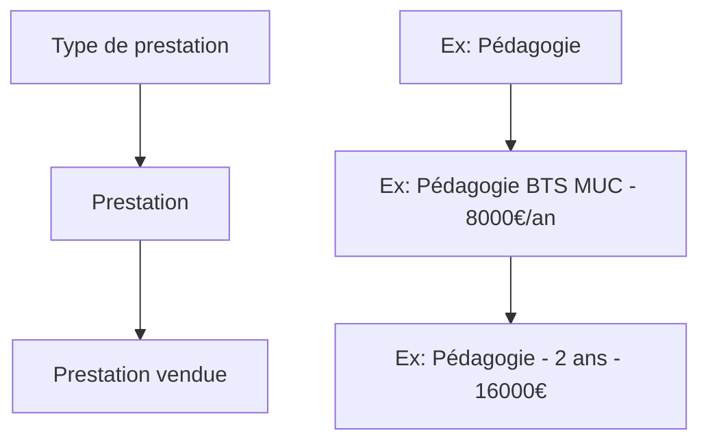

## Vue d'ensemble

Le système de prestations dans Papaours fonctionne sur **trois niveaux** :



| Niveau | Rôle | Exemple |
|--------|------|---------|
| **Type de prestation** | Catégorie de service (système ou personnalisé) | Pédagogie, Hébergement |
| **Prestation** | Élément du catalogue avec tarification | Pédagogie BTS à 8000€/an |
| **Prestation vendue** | Instance dans un dossier avec quantité | 2 années de pédagogie = 16000€ |

---

## Types de prestations

### Définition

Un **type de prestation** définit une catégorie de service pouvant être facturé. Il détermine les règles applicables (voies d'accès, unités de vente autorisées).

### Caractéristiques

| Propriété | Description |
|-----------|-------------|
| Code | Identifiant unique (ex: `PAPAOURS-TPT-PEDAGOGIE`) |
| Intitulé | Libellé affiché (ex: "Pédagogie de la formation") |
| État | `RESERVE` (système) ou `PERSONNALISE` (créé par l'utilisateur) |
| Voies d'accès autorisées | Apprentissage, Professionnalisation, Continue |
| Unités de vente autorisées | Liste des unités utilisables pour ce type |

### Catalogue des types de prestations système

#### Prestation principale

| Code | Intitulé | Unités de vente |
|------|----------|-----------------|
| `PAPAOURS-TPT-PEDAGOGIE` | Pédagogie de la formation | Année (proratisée ou non), Mois, Jour, Heure |

#### Hébergement et restauration

| Code | Intitulé | Unités de vente |
|------|----------|-----------------|
| `PAPAOURS-TPT-HEBERGEMENT` | Prestation d'hébergement | Forfait, Nuitée |
| `PAPAOURS-TPT-RESTAURATION-MIDI` | Restauration repas du midi | Forfait, Repas |
| `PAPAOURS-TPT-RESTAURATION-SOIR` | Restauration repas du soir | Forfait, Repas |

#### Équipement et accompagnement

| Code | Intitulé | Unités de vente |
|------|----------|-----------------|
| `PAPAOURS-TPT-1ER-EQUIPEMENT` | 1er équipement | Forfait |
| `PAPAOURS-TPT-ACC-RQTH` | Accompagnement RQTH | Forfait |

#### Mobilité

| Code | Intitulé | Unités de vente |
|------|----------|-----------------|
| `PAPAOURS-TPT-FORFAIT-MOBILITE` | Forfait mobilité internationale | Forfait |
| `PAPAOURS-FRAIS-MOBILITE-APPRENTI` | Frais de mobilité apprenti | Forfait |

#### Participation employeur

| Code | Intitulé | Unités de vente |
|------|----------|-----------------|
| `PAPAOURS-TPT-PARTICIPATION-OBLIGATOIRE-EMPLOYEUR` | Participation Employeur – Diplôme niveau > 5 | Forfait |

---

## Prestations (catalogue)

### Définition

Une **prestation** est un élément du catalogue, basé sur un type de prestation. Elle définit un service concret avec sa tarification.

### Caractéristiques

| Propriété | Description |
|-----------|-------------|
| Code | Identifiant unique généré (ex: `PREST-2025-000001`) |
| Type de prestation | Le type auquel elle appartient |
| Intitulé | Libellé personnalisable |
| Montant unitaire HT | Prix de base hors taxes |
| Taux de TVA | Taux applicable (souvent exonéré pour la formation) |
| Unité de vente | Comment elle est facturée (forfait, heure, nuitée...) |
| Statut | Actif ou Inactif |

### Exemple de prestations dans le catalogue

| Type | Intitulé | Montant HT | Unité | TVA |
|------|----------|------------|-------|-----|
| Pédagogie | Pédagogie BTS Commerce | 8 000 € | Année proratisée | 0% |
| Pédagogie | Pédagogie Licence Pro | 6 500 € | Année non proratisée | 0% |
| Hébergement | Internat semaine | 45 € | Nuitée | 10% |
| Restauration | Demi-pension | 8 € | Repas | 10% |

### Calcul de quantité

Selon l'unité de vente, le système peut calculer automatiquement la quantité :

| Unité | Base de calcul |
|-------|---------------|
| `ANNEE_PRORATISEE` | Durée du financement en années (avec décimales) |
| `ANNEE_NON_PRORATISEE` | Nombre d'années entières |
| `MOIS` | Durée en mois |
| `JOUR` | Nombre de jours en centre |
| `HEURE` | Volume horaire de la formation |
| `FORFAIT` | Toujours 1 |

---

## Prestations vendues

### Définition

Une **prestation vendue** est l'instanciation d'une prestation du catalogue dans un dossier de financement spécifique. Elle représente ce qui est réellement facturé pour un contrat donné.

### Caractéristiques

| Propriété | Description |
|-----------|-------------|
| Prestation source | Référence à la prestation du catalogue |
| Intitulé | Peut être personnalisé (sinon hérité de la prestation) |
| Prix unitaire | Peut être personnalisé (sinon hérité de la prestation) |
| Quantité | Nombre d'unités (par défaut 1) |
| Obligatoire | Si vrai, ne peut pas être supprimée |
| Montant total HT | Prix unitaire × Quantité |
| Montant total TTC | Montant HT + TVA |

### Formules de calcul

```
Montant total HT = Prix unitaire HT × Quantité

Montant total TTC = Prix unitaire TTC × Quantité
```

### Exemple concret

**Prestation du catalogue** :
- Intitulé : "Pédagogie BTS Commerce"
- Montant unitaire : 8 000 € HT
- Unité : Année proratisée
- TVA : 0%

**Prestation vendue** (dans un dossier de financement) :
- Prestation source : Pédagogie BTS Commerce
- Quantité : 1.75 (contrat de 21 mois = 1.75 années)
- Montant total HT : 8 000 € × 1.75 = **14 000 €**

### Personnalisation

Lors de la création d'une prestation vendue, il est possible de :

1. **Conserver les valeurs du catalogue** : l'intitulé et le prix sont hérités
2. **Personnaliser l'intitulé** : adapter le libellé au contexte du contrat
3. **Personnaliser le prix** : appliquer un tarif négocié différent du catalogue

### Prestations vendues obligatoires

Certaines prestations vendues sont marquées comme **obligatoires** :

- Elles sont ajoutées automatiquement lors de la création du dossier
- Elles ne peuvent pas être supprimées du dossier
- Leurs ventilations associées ne peuvent pas être supprimées

Exemple : la participation obligatoire employeur (750 €) pour les diplômes de niveau > 5.

---

## Unités de vente

Les unités de vente définissent comment une prestation est facturée :

| Unité | Description | Exemple |
|-------|-------------|---------|
| `FORFAIT` | Montant fixe global | 500 € forfait équipement |
| `ANNEE_PRORATISEE` | Par année, ajusté selon la durée | 8000 €/an × 1.75 = 14000 € |
| `ANNEE_NON_PRORATISEE` | Par année complète | 8000 €/an × 2 = 16000 € |
| `MOIS` | Par mois | 200 €/mois × 12 = 2400 € |
| `JOUR` | Par jour | 50 €/jour × 20 = 1000 € |
| `HEURE` | Par heure | 25 €/h × 400h = 10000 € |
| `NUITEE` | Par nuit | 45 €/nuit × 50 = 2250 € |
| `REPAS` | Par repas | 8 €/repas × 100 = 800 € |
| `PIECE` | À l'unité | Usage divers |

---

## Voies d'accès

Chaque type de prestation est autorisé pour certaines voies d'accès :

| Voie d'accès | Description |
|--------------|-------------|
| `APPRENTISSAGE` | Contrat d'apprentissage |
| `PROFESSIONNALISATION` | Contrat de professionnalisation |
| `CONTINUE` | Formation continue |

La plupart des prestations sont disponibles pour l'apprentissage et la professionnalisation. Seule la prestation de pédagogie est également disponible pour la formation continue.

---

### Pour aller plus loin

Poursuivez avec la page suivante :
[04 - La ventilation des prestations](04-ventilation)
