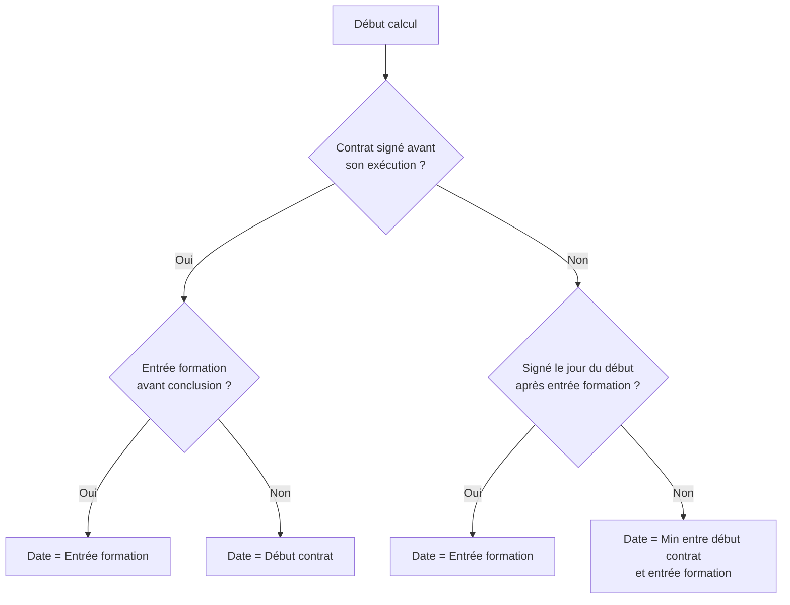

## Vue d'ensemble

Un dossier de financement est caractérisé par :

- Une **date de début** de financement
- Une **date de fin** de financement
- Une **durée** calculée automatiquement

Ces dates sont déterminées automatiquement lors de la création du dossier, selon des règles métier précises.

---

## Type de financement

Le type de financement est déterminé par la **catégorie de l'employeur** :

| Catégorie employeur | Type de financement |
|---------------------|---------------------|
| Publique            | `PUBLIC`            |
| Privée              | `PRIVE`             |

Le type de financement influence le calcul de la date de début.

---

## Date de début du financement

### Financement PUBLIC

Pour un employeur de catégorie publique, la règle est simple :

```
Date de début = Date de début du contrat
```

### Financement PRIVÉ

Pour un employeur de catégorie privée, le calcul prend en compte trois dates :

| Date                       | Description                                   |
|----------------------------|-----------------------------------------------|
| Date de conclusion         | Date de signature du contrat                  |
| Date de début du contrat   | Date de début d'exécution du contrat          |
| Date d'entrée en formation | Date à laquelle l'apprenti entre en formation |

#### Règles de calcul



#### Cas concrets

| Cas                                | Conclusion | Début contrat | Entrée formation | Date début financement |
|------------------------------------|------------|---------------|------------------|------------------------|
| Dates identiques                   | 01/09      | 01/09         | 01/09            | 01/09                  |
| Signature anticipée                | 19/08      | 01/09         | 01/09            | 01/09                  |
| Entrée formation avant             | 01/09      | 01/09         | 01/08            | 01/08                  |
| Signature anticipée + entrée avant | 15/08      | 01/09         | 01/08            | 01/08                  |

---

## Date de fin du financement

### Sans rupture de contrat

```
Date de fin = Date de fin du contrat
```

### Avec rupture de contrat

En cas de rupture, l'apprenti peut continuer à fréquenter le CFA pendant **6 mois** après la rupture, dans la limite de
la fin de session.

```
Date de fin = Min(Date rupture + 6 mois, Date fin session)
```

#### Exemples

| Situation                   | Date rupture | Date fin session | Date fin financement   |
|-----------------------------|--------------|------------------|------------------------|
| Rupture en cours de session | 15/01/2026   | 30/06/2026       | 15/07/2026             |
| Rupture proche de la fin    | 01/05/2026   | 30/06/2026       | 30/06/2026 (plafonnée) |
| Pas de rupture              | -            | 30/06/2026       | Date fin contrat       |

---

## Durée du financement

### Date de bascule : 1er juillet 2025

La méthode de calcul de la durée dépend de la **date de conclusion du contrat** :

| Date de conclusion     | Unité de calcul |
|------------------------|-----------------|
| Avant le 01/07/2025    | **Mois**        |
| À partir du 01/07/2025 | **Jours**       |

### Calcul en mois (contrats conclus avant le 01/07/2025)

```
Durée = Nombre de mois entre date début et date fin
```

**Règle importante** : tout mois entamé est comptabilisé comme un mois entier.

| Date début | Date fin   | Durée   |
|------------|------------|---------|
| 01/09/2025 | 01/09/2026 | 12 mois |
| 01/09/2025 | 30/06/2027 | 22 mois |
| 01/09/2025 | 15/09/2025 | 1 mois  |
| 01/09/2025 | 02/10/2025 | 2 mois  |

### Calcul en jours (contrats conclus à partir du 01/07/2025)

```
Durée = Nombre de jours entre date début et date fin + 1
```

Le **+1** permet d'inclure le jour de début dans le décompte.

| Date début | Date fin   | Durée     |
|------------|------------|-----------|
| 01/09/2025 | 31/08/2026 | 365 jours |
| 01/09/2025 | 01/09/2026 | 366 jours |
| 01/09/2025 | 30/06/2027 | 668 jours |
| 01/09/2025 | 01/09/2025 | 1 jour    |

---

## Impact sur les prestations

Lorsque les dates de financement sont modifiées, le système **recalcule automatiquement les quantités** des prestations
vendues dont l'unité de vente dépend de la durée :

| Unité de vente         | Impact                                      |
|------------------------|---------------------------------------------|
| `ANNEE_PRORATISEE`     | Quantité recalculée selon la nouvelle durée |
| `ANNEE_NON_PRORATISEE` | Quantité recalculée en années entières      |
| `MOIS`                 | Quantité recalculée en mois                 |
| `FORFAIT`              | Pas d'impact (quantité = 1)                 |

### Exemple (contrat conclu avant le 01/07/2025)

**Avant modification** :

- Date début : 01/09/2025
- Date fin : 31/08/2026
- Durée : 12 mois
- Prestation pédagogie (12 000 €/an) :
    - Prix divisé : 12 000 € ÷ 12 = 1 000 €/mois
    - Montant : 1 000 € × 12 = **12 000 €**

**Après modification** :

- Date début : 01/09/2025
- Date fin : 31/12/2026
- Durée : 16 mois
- Prestation pédagogie (12 000 €/an) :
    - Prix divisé : 12 000 € ÷ 12 = 1 000 €/mois
    - Montant : 1 000 € × 16 = **16 000 €**

---

## Récapitulatif des règles

| Élément                     | Règle                                                      |
|-----------------------------|------------------------------------------------------------|
| Type financement            | PUBLIC si employeur public, PRIVÉ sinon                    |
| Date début (PUBLIC)         | Date de début du contrat                                   |
| Date début (PRIVÉ)          | Calcul selon conclusion, début contrat et entrée formation |
| Date fin (sans rupture)     | Date de fin du contrat                                     |
| Date fin (avec rupture)     | Rupture + 6 mois, plafonnée par fin session                |
| Durée (avant 01/07/2025)    | En mois, mois entamé = mois dû                             |
| Durée (à partir 01/07/2025) | En jours, jour de début inclus                             |

---

### Pour aller plus loin

Retour à l'introduction :
[01 - Introduction au financement](01-introduction)
