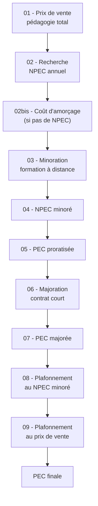
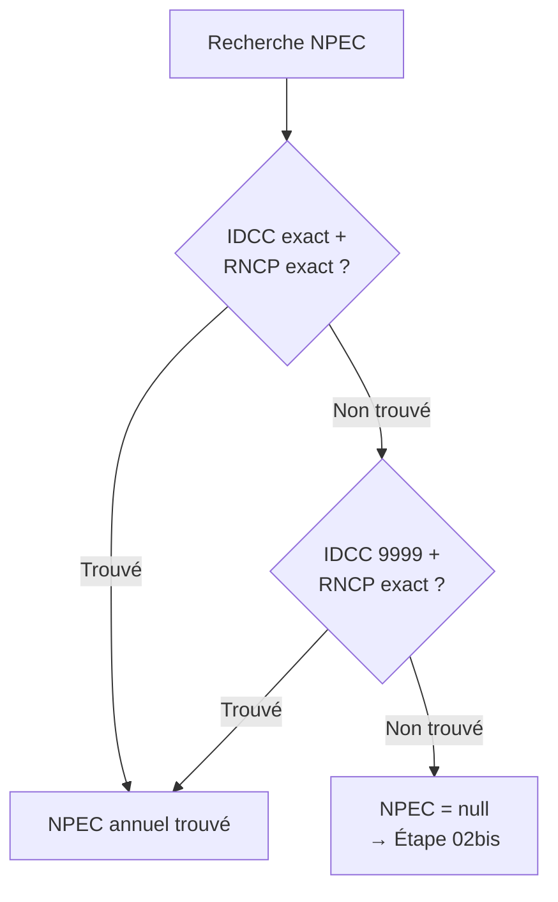

## Vue d'ensemble

Le **moteur de financement pédagogie** calcule la **PEC (Prise En Charge)** finale de la prestation pédagogique par l'OPCO. Ce calcul s'effectue en **9 étapes** successives, depuis le prix de vente jusqu'au montant final plafonné.

La PEC finale correspond au montant de la ventilation pédagogie prise en charge par le financeur OPCO.

### Schéma de la chaîne de calcul



### Règle transversale : pas d'arrondi

Pendant l'ensemble des calculs intermédiaires, **aucun arrondi n'est appliqué**. Les montants sont conservés avec une précision de **6 décimales**. L'arrondi n'est effectué qu'à l'affichage final des montants.

---

## Étape 01 — Prix de vente pédagogie total

**Objectif** : déterminer le montant total des prestations pédagogiques vendues.

### Formule

```
Prix vente pédagogie total = Somme des montants HT des prestations vendues
                             de type PAPAOURS-TPT-PEDAGOGIE
```

Seules les prestations de type `PAPAOURS-TPT-PEDAGOGIE` sont prises en compte dans ce calcul. Les autres types de prestations (hébergement, restauration, etc.) sont exclus.

---

## Étape 02 — Recherche du NPEC annuel

**Objectif** : trouver le Niveau de Prise En Charge annuel dans le référentiel OPCO.

### Données d'entrée

Le système utilise les informations du contrat d'apprentissage :

| Donnée | Source |
|--------|--------|
| IDCC | Convention collective du contrat |
| Code RNCP | Certification préparée |
| Date de conclusion | Date de signature du contrat |

### Algorithme de recherche

Le système recherche dans le référentiel OPCO une correspondance :

1. **IDCC exact** + **Code RNCP exact** + date de conclusion comprise dans l'intervalle de validité
2. Si aucun résultat : recherche avec **IDCC = 9999** (générique) + Code RNCP exact
3. Si toujours aucun résultat : **NPEC = null** (passage au coût d'amorçage)



### Résultat

Lorsqu'un NPEC est trouvé, une **subvention NPEC OPCO** est créée automatiquement (ou **Coût de carence** si le statut dans le référentiel est "D").

---

## Étape 02bis — Coût d'amorçage

**Objectif** : fournir un montant de prise en charge de secours lorsqu'aucun NPEC n'est disponible.

### Condition de déclenchement

Cette étape n'est exécutée **que si** l'étape 02 n'a retourné aucun NPEC. Les subventions NPEC OPCO et Coût d'amorçage sont **mutuellement exclusives**.

### Données d'entrée

| Donnée | Source |
|--------|--------|
| Niveau de certification | Certification préparée du contrat |
| Date de conclusion | Date de signature du contrat |

### Algorithme

Le système recherche dans le référentiel des coûts d'amorçage une correspondance par niveau de certification et date de conclusion comprise dans l'intervalle de validité.

### Résultat

Si un coût d'amorçage est trouvé, une **subvention Coût d'amorçage** est créée. Si aucun résultat n'est trouvé, aucune subvention n'est créée et le traitement se poursuit.

---

## Étape 03 — Minoration formation à distance

**Objectif** : appliquer une réduction proportionnelle aux heures de formation à distance.

### Condition

La minoration s'applique uniquement si le contrat comporte un **volume horaire à distance supérieur à 0**.

### Formule

```
Minoration FAD = NPEC annuel × (heures à distance / heures totales) × 0.10
```

| Cas | Résultat |
|-----|----------|
| Heures à distance > 0 | Subvention **Minoration formation à distance** créée avec montant négatif |
| Heures à distance = 0 | Minoration = 0, pas de subvention créée |

### Exemple

- NPEC annuel : 8 000 €
- Heures totales : 1 200 h
- Heures à distance : 300 h

```
Minoration = 8 000 × (300 / 1 200) × 0.10 = 8 000 × 0.25 × 0.10 = 200 €
```

La subvention créée aura un montant de **-200 €**.

---

## Étape 04 — NPEC minoré

**Objectif** : calculer le NPEC après application de la minoration formation à distance.

### Formule

```
NPEC minoré = NPEC annuel - Minoration FAD
```

Si la minoration est de 0 (pas d'heures à distance), le NPEC minoré est égal au NPEC annuel.

---

## Étape 05 — PEC proratisée

**Objectif** : proratiser le NPEC minoré sur la durée réelle du contrat.

### Mode de calcul

Le mode de proratisation dépend de la **date de conclusion du contrat** :

| Date de conclusion | Mode | Formule |
|--------------------|------|---------|
| Avant le 01/07/2025 | Mois | `PEC proratisée = (NPEC minoré / 12) × durée en mois` |
| À partir du 01/07/2025 | Jours | `PEC proratisée = (NPEC minoré / 365) × durée en jours` |

### Exemples

**Mode mois** (contrat conclu avant le 01/07/2025) :
- NPEC minoré : 7 800 €
- Durée : 18 mois

```
PEC proratisée = (7 800 / 12) × 18 = 650 × 18 = 11 700 €
```

**Mode jours** (contrat conclu à partir du 01/07/2025) :
- NPEC minoré : 7 800 €
- Durée : 365 jours

```
PEC proratisée = (7 800 / 365) × 365 = 7 800 €
```

---

## Étape 06 — Majoration contrat court

**Objectif** : appliquer une majoration de 10 % pour les contrats courts.

### Conditions

Les **deux conditions** doivent être réunies :

| Condition | Critère |
|-----------|---------|
| Durée du contrat | Strictement inférieure à 365 jours |
| Type de dérogation | Dérogation de type 21 |

### Formule

```
Majoration contrat court = PEC proratisée × 0.10
```

| Cas | Résultat |
|-----|----------|
| Contrat court (< 365 jours + dérogation 21) | Subvention **Majoration contrat court** créée |
| Contrat non court | Majoration = 0 |

### Exemple

- PEC proratisée : 5 000 €
- Durée : 200 jours, dérogation type 21

```
Majoration = 5 000 × 0.10 = 500 €
```

---

## Étape 07 — PEC majorée

**Objectif** : calculer la PEC après application de la majoration contrat court.

### Formule

```
PEC majorée = PEC proratisée + Majoration contrat court
```

Si le contrat n'est pas court, la PEC majorée est égale à la PEC proratisée.

---

## Étape 08 — Plafonnement au NPEC minoré

**Objectif** : garantir que le financement ne dépasse pas le NPEC annuel minoré. Ce plafonnement concerne principalement les contrats courts dont la majoration pourrait faire dépasser le NPEC.

### Formule

```
PEC plafonnée = Min(PEC majorée, NPEC minoré)
```

---

## Étape 09 — Plafonnement au prix de vente

**Objectif** : garantir que le financement OPCO ne dépasse pas le prix de vente réel de la prestation pédagogique.

### Formule

```
PEC finale = Min(PEC plafonnée, Prix vente pédagogie total)
```

La PEC finale est le montant réellement financé par l'OPCO.

---

## Exemple complet

Voici un exemple traversant les 9 étapes pour un contrat conclu **à partir du 01/07/2025** :

### Données du contrat

| Donnée | Valeur |
|--------|--------|
| Prix vente pédagogie | 7 500 € |
| NPEC annuel trouvé | 8 000 € |
| Heures totales | 1 200 h |
| Heures à distance | 300 h |
| Durée du contrat | 300 jours |
| Dérogation | Type 21 |
| Date de conclusion | 01/09/2025 |

### Déroulement des calculs

| Étape | Calcul | Résultat |
|-------|--------|----------|
| 01 - Prix vente pédagogie | Somme HT des prestations pédagogie | **7 500 €** |
| 02 - NPEC annuel | Recherche référentiel OPCO | **8 000 €** |
| 03 - Minoration FAD | 8 000 × (300/1200) × 0.10 | **-200 €** |
| 04 - NPEC minoré | 8 000 - 200 | **7 800 €** |
| 05 - PEC proratisée | (7 800 / 365) × 300 | **6 410.958904 €** |
| 06 - Majoration contrat court | 6 410.958904 × 0.10 (< 365j + dér. 21) | **641.095890 €** |
| 07 - PEC majorée | 6 410.958904 + 641.095890 | **7 052.054794 €** |
| 08 - Plafonnement NPEC minoré | Min(7 052.054794, 7 800) | **7 052.054794 €** |
| 09 - Plafonnement prix vente | Min(7 052.054794, 7 500) | **7 052.054794 €** |

**PEC finale : 7 052,05 €** (après arrondi à l'affichage)

---

## Cas particuliers

| Situation | Résultat |
|-----------|----------|
| Aucun NPEC et aucun coût d'amorçage trouvé | Pas de subvention, PEC = 0 € |
| Prix de vente < PEC calculée | PEC finale = prix de vente |
| Contrat de 365 jours exactement | Pas considéré comme contrat court (< 365 strict) |
| Dérogation autre que type 21 | Pas de majoration contrat court |

---

### Pour aller plus loin

Poursuivez avec la page suivante :
[10 - Financement RQTH](10-financement-rqth)
