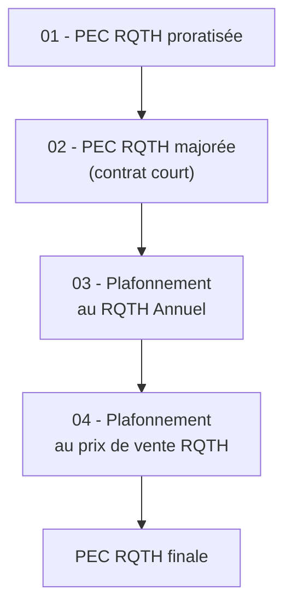

## Vue d'ensemble

Le financement **RQTH** (Reconnaissance de la Qualité de Travailleur Handicapé) permet une prise en charge supplémentaire pour l'accompagnement des apprentis reconnus travailleurs handicapés.

Ce financement est lié à la prestation de type `PAPAOURS-TPT-ACC-RQTH` (Accompagnement RQTH) et fait l'objet d'un calcul spécifique en **4 étapes**.

---

## Conditions d'activation

### Montant RQTH annuel

Le calcul de la PEC RQTH nécessite que le champ **"Montant RQTH Annuel"** soit renseigné sur le dossier de financement. Ce champ est visible et saisissable uniquement si l'apprenant est déclaré comme **travailleur handicapé** dans sa fiche.

### Condition d'affichage du champ

| Condition | Champ visible | PEC RQTH |
|-----------|--------------|----------|
| Apprenant travailleur handicapé = **Oui** | Oui | Calculée selon la chaîne ci-dessous |
| Apprenant travailleur handicapé = **Non** | Non | Automatiquement 0 € |

### Caractéristiques du champ

| Propriété | Valeur |
|-----------|--------|
| Type | Montant en euros |
| Décimales | 2 décimales autorisées |
| Valeur minimale | 0 € |
| Obligatoire | Non (mais nécessaire pour une PEC RQTH > 0) |
| Plafond au calcul | 4 000 € |

Si l'utilisateur saisit un montant supérieur à 4 000 €, le calcul utilisera automatiquement le plafond :

```
RQTH Annuel retenu = Min(Montant saisi, 4 000 €)
```

### Condition d'éligibilité au calcul

Le calcul de la PEC RQTH s'effectue uniquement si le dossier de financement présente une **prestation Accompagnement RQTH** avec un montant strictement supérieur à 0 €.

| Cas | Résultat |
|-----|----------|
| Aucune prestation RQTH | PEC RQTH = 0 € |
| Prestation RQTH = 0 € | PEC RQTH = 0 € |
| Prestation RQTH > 0 € | Calcul selon la chaîne ci-dessous |

### Mise à jour dynamique

Si la qualité de travailleur handicapé est retirée de la fiche apprenant (passage de Oui à Non) :

- Le champ Montant RQTH Annuel disparaît
- Le montant précédemment saisi est ignoré
- La PEC RQTH devient automatiquement **0 €**

---

## Chaîne de calcul PEC RQTH

Le calcul de la PEC RQTH suit une chaîne en **4 étapes**, similaire dans sa logique au moteur de financement pédagogie :



---

## Étape 01 — PEC RQTH proratisée

**Objectif** : proratiser le montant RQTH annuel sur la durée réelle du contrat.

### Mode de calcul

Comme pour la pédagogie, le mode de proratisation dépend de la **date de conclusion du contrat** :

| Date de conclusion | Mode | Formule |
|--------------------|------|---------|
| Avant le 01/07/2025 | Mois | `PEC RQTH proratisée = (RQTH Annuel / 12) × durée en mois` |
| À partir du 01/07/2025 | Jours | `PEC RQTH proratisée = (RQTH Annuel / 365) × durée en jours` |

---

## Étape 02 — PEC RQTH majorée

**Objectif** : appliquer la majoration contrat court sur la PEC RQTH.

### Conditions

Les mêmes conditions que pour la pédagogie s'appliquent :

| Condition | Critère |
|-----------|---------|
| Durée du contrat | Strictement inférieure à 365 jours |
| Type de dérogation | Dérogation de type 21 |

### Formule

```
Majoration RQTH = PEC RQTH proratisée × 0.10
PEC RQTH majorée = PEC RQTH proratisée + Majoration RQTH
```

Si le contrat n'est pas court, la PEC RQTH majorée est égale à la PEC RQTH proratisée.

---

## Étape 03 — Plafonnement au RQTH Annuel

**Objectif** : garantir que la PEC RQTH ne dépasse pas le montant RQTH annuel retenu.

### Formule

```
PEC RQTH plafonnée = Min(PEC RQTH majorée, RQTH Annuel)
```

Pour rappel, le RQTH Annuel est lui-même plafonné à 4 000 €.

---

## Étape 04 — Plafonnement au prix de vente RQTH

**Objectif** : garantir que la PEC RQTH ne dépasse pas le montant HT de la prestation RQTH vendue.

### Formule

```
PEC RQTH finale = Min(PEC RQTH plafonnée, Montant HT prestation RQTH)
```

---

## Résultat

La PEC RQTH finale correspond au montant de la **ventilation OPCO** créée pour la prestation Accompagnement RQTH. Cette ventilation est créée automatiquement par le moteur de financement.

---

## Exemples concrets

### Exemple 1 : Contrat standard (> 365 jours)

| Donnée | Valeur |
|--------|--------|
| Montant RQTH Annuel saisi | 3 000 € |
| Durée du contrat | 365 jours |
| Date de conclusion | 01/09/2025 |
| Prestation RQTH vendue | 3 000 € HT |

| Étape | Calcul | Résultat |
|-------|--------|----------|
| 01 - Proratisation | (3 000 / 365) × 365 | **3 000 €** |
| 02 - Majoration | Pas de contrat court | **0 €** |
| 03 - Plafonnement RQTH | Min(3 000, 3 000) | **3 000 €** |
| 04 - Plafonnement prix | Min(3 000, 3 000) | **3 000 €** |

**PEC RQTH finale : 3 000 €**

### Exemple 2 : Contrat court avec plafonnement

| Donnée | Valeur |
|--------|--------|
| Montant RQTH Annuel saisi | 4 000 € |
| Durée du contrat | 300 jours |
| Date de conclusion | 01/09/2025 |
| Dérogation | Type 21 |
| Prestation RQTH vendue | 5 000 € HT |

| Étape | Calcul | Résultat |
|-------|--------|----------|
| 01 - Proratisation | (4 000 / 365) × 300 | **3 287.671232 €** |
| 02 - Majoration | 3 287.671232 × 0.10 | **328.767123 €** |
| 02 - PEC majorée | 3 287.671232 + 328.767123 | **3 616.438356 €** |
| 03 - Plafonnement RQTH | Min(3 616.438356, 4 000) | **3 616.438356 €** |
| 04 - Plafonnement prix | Min(3 616.438356, 5 000) | **3 616.438356 €** |

**PEC RQTH finale : 3 616,44 €** (après arrondi à l'affichage)

### Exemple 3 : Dépassement du plafond annuel

| Donnée | Valeur |
|--------|--------|
| Montant RQTH Annuel saisi | 5 000 € (plafonné à 4 000 €) |
| Durée du contrat | 400 jours |
| Date de conclusion | 01/09/2025 |
| Prestation RQTH vendue | 6 000 € HT |

| Étape | Calcul | Résultat |
|-------|--------|----------|
| 01 - Proratisation | (4 000 / 365) × 400 | **4 383.561643 €** |
| 02 - Majoration | Pas de contrat court | **0 €** |
| 03 - Plafonnement RQTH | Min(4 383.561643, 4 000) | **4 000 €** |
| 04 - Plafonnement prix | Min(4 000, 6 000) | **4 000 €** |

**PEC RQTH finale : 4 000 €**

---

### Pour aller plus loin

Poursuivez avec la page suivante :
[11 - Échéancier de facturation](11-echeancier)
