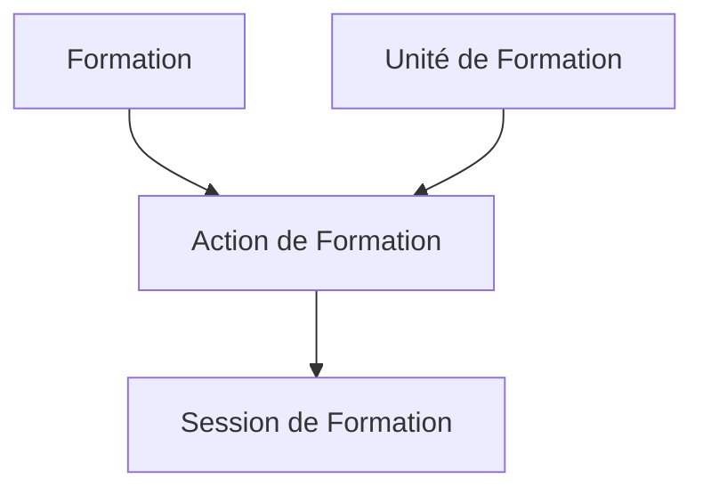

## Objectif de cette section

Cette documentation vous guide dans l'utilisation du module **Formations** de Papaours.
Elle vous permettra de comprendre comment gérer votre catalogue de formations, créer des actions de formation et programmer des sessions.

Le module Formations est structuré selon une **hiérarchie à trois niveaux** :

1. **Formation** : Le diplôme ou la certification (niveau national, référencé RNCP)
2. **Action de Formation** : La formation dispensée par une unité de formation spécifique
3. **Session de Formation** : Une période de formation avec des dates et des inscrits

---

## Public visé

Cette documentation s'adresse aux :

- **Responsables pédagogiques** en charge de l'offre de formation
- **Gestionnaires de sessions** qui planifient les cohortes
- **Administrateurs** qui paramètrent le catalogue
- Utilisateurs disposant des **droits d'accès à la gestion des formations** dans l'application

---

## Fonctionnalités principales

Le module Formations permet de :

- **Créer et gérer des formations** à partir du référentiel national (RNCP)
- **Importer des formations** depuis les sources officielles
- **Créer des actions de formation** rattachées à une unité de formation
- **Programmer des sessions** avec dates et capacités
- **Suivre les inscriptions** par session
- **Générer des documents** liés aux formations

---

## Pour aller plus loin

Poursuivez avec la page suivante :
[02 - Définition des concepts clés](02-definition-concepts-cles)
