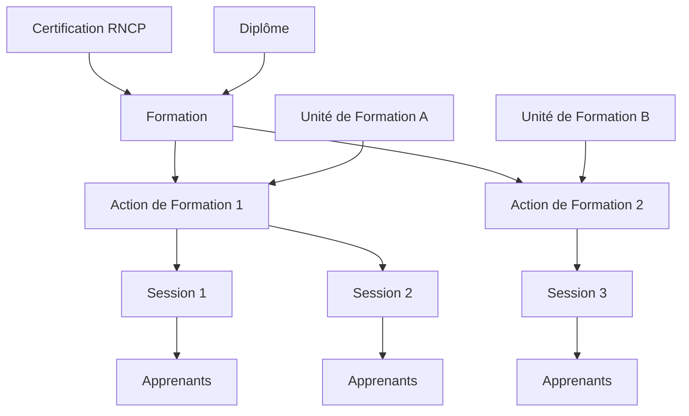

## Concepts fondamentaux

### Formation

Une formation représente un diplôme ou une certification enregistrée au niveau national. Elle est caractérisée par :

- **Référence** : Identifiant unique auto-généré (format : FOR + année + numéro, ex: FOR2026-000016)
- **Intitulé** : Nom officiel de la formation
- **Intitulé commercial** : Nom utilisé pour la communication
- **Certification RNCP** : Code et intitulé de la certification (ex: RNCP38586)
- **Diplôme** : Code et intitulé du diplôme (ex: TH1-X MANAGER DE LA STRATEGIE MARKETING)
- **Durée théorique** : Durée prévue de la formation (en années ou mois)
- **Volume d'heures** : Nombre d'heures de formation
- **Voies d'accès** : Modes d'accès possibles (Apprentissage, Continue, VAE, etc.)
- **Distanciel** : Part de formation à distance (heures et pourcentage)

### Unité de Formation (UFA)

L'unité de formation est le site ou établissement qui dispense la formation. Elle fait le lien entre la formation théorique et sa mise en œuvre pratique.

Une unité de formation est caractérisée par :
- **Nom usuel** : Nom d'usage de l'unité
- **Adresse** : Localisation physique
- **Rattachement** : Organisation de tutelle

### Action de Formation

L'action de formation représente une formation dispensée par une unité de formation spécifique. C'est le niveau intermédiaire entre la formation (catalogue) et la session (programmation).

Une action de formation est caractérisée par :
- **Formation** de rattachement
- **Unité de formation** qui la dispense
- **Paramètres pédagogiques** spécifiques à ce site

### Session de Formation

La session de formation est une période programmée pendant laquelle des apprenants suivent une action de formation.

Une session est caractérisée par :
- **Référence** : Identifiant unique (format : SF + année + numéro, ex: SF2026-000041)
- **Intitulé** : Nom de la session
- **Date de début** : Début de la session
- **Date de fin** : Fin de la session
- **Date de fin d'examen** : Date limite des épreuves
- **Nombre d'inscrits** : Effectif de la session
- **Lieu de formation** : Adresse où se déroule la formation

---

## Certification et Diplôme

### Certification RNCP

Le Répertoire National des Certifications Professionnelles (RNCP) recense les certifications reconnues par l'État. Chaque certification possède :

| Attribut | Description |
|----------|-------------|
| **Code RNCP** | Identifiant unique (ex: RNCP38586) |
| **Intitulé** | Nom officiel de la certification |
| **État** | Active ou Inactive |
| **Date d'échéance** | Date de fin de validité |
| **Niveau de qualification** | Niveau 3 à 8 (ancien niveau I à V) |

### Diplôme

Le diplôme est la qualification délivrée à l'issue de la formation :

| Attribut | Description |
|----------|-------------|
| **Code diplôme** | Code officiel (ex: 16X31266) |
| **Intitulé court** | Version abrégée |
| **Intitulé complet** | Nom complet avec préfixe |
| **Diplôme ou titre visé** | Type de certification |
| **Niveau de formation** | Catégorie du diplôme |
| **Code MEF** | Code du Ministère de l'Éducation (si applicable) |

---

## Relations entre les entités

---

## Pour aller plus loin

Poursuivez avec la page suivante :
[03 - Gérer les formations](03-gerer-formations)
