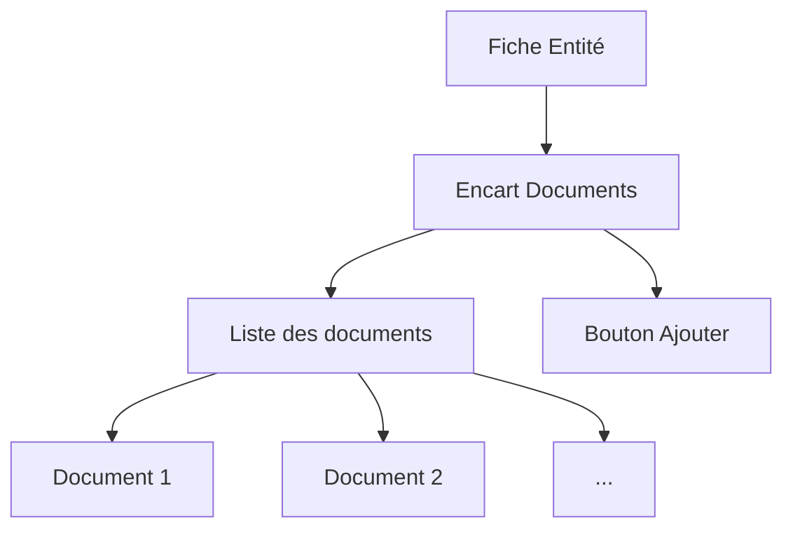

# Introduction aux documents associés

## Qu'est-ce qu'un document associé ?

Un **document associé** est un fichier attaché à une entité dans Papaours. Il peut s'agir de justificatifs, de pièces administratives, de contrats scannés, ou de tout autre document pertinent pour le suivi d'un dossier.

## Objectifs du système

Le système de documents associés permet de :

- **Centraliser** tous les documents relatifs à une entité au même endroit
- **Tracer** les ajouts et modifications de documents
- **Sécuriser** l'accès aux documents sensibles via les permissions
- **Faciliter** la recherche et la consultation des pièces

## Types de documents

Les documents associés peuvent inclure :

| Type | Exemples | Entité concernée |
|------|----------|------------------|
| **Pièces d'identité** | CNI, passeport, titre de séjour | Apprenant |
| **Justificatifs** | Attestation RQTH, certificat sportif | Apprenant (besoins spécifiques) |
| **Documents administratifs** | Extrait Kbis, attestation URSSAF | Employeur |
| **Contrats** | Contrat signé, avenants | Contrat |
| **Certificats** | Attestation de formation, diplôme | Dossier de formation |

## Encarts "Documents associés"

Chaque entité majeure de Papaours dispose d'un encart **"Documents"** ou **"Documents associés"** dans sa fiche de consultation. Cet encart permet de :

- Visualiser la liste des documents attachés
- Ajouter de nouveaux documents
- Télécharger ou supprimer des documents existants

## Sécurité et confidentialité

Les documents associés sont soumis aux règles de sécurité de Papaours :

- **Permissions** : seuls les utilisateurs autorisés peuvent consulter ou modifier les documents
- **Traçabilité** : chaque action (ajout, suppression, téléchargement) est historisée
- **Données sensibles** : certains documents (besoins spécifiques) bénéficient de protections supplémentaires

---

## Pour aller plus loin

-> [02 - Encarts par entité](02-encarts-par-entite)
