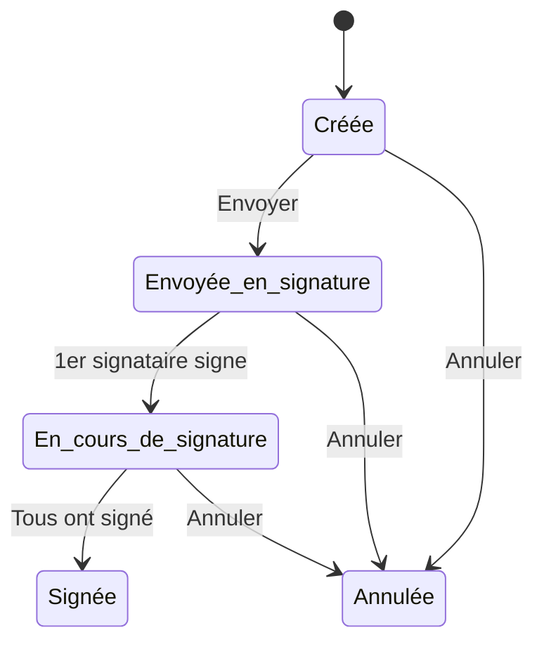

## Concepts fondamentaux

### Types de documents

| Type | Description | Signatures possibles |
|------|-------------|---------------------|
| **Document généré** | Document créé automatiquement par l'application à partir d'un template (ex: CERFA, Convention) | Manuelle et Électronique |
| **Document téléversé** | Document importé manuellement dans l'application (scan, fichier externe) | Manuelle uniquement |

### Types de signature

| Type | Canal | Description |
|------|-------|-------------|
| **Signature manuelle** | `MANUELLE` | Processus hors application : le document est transmis aux signataires (email ou impression), signé, puis le scan est téléversé |
| **Signature électronique** | `DOCUSEAL` | Processus dématérialisé : les signataires reçoivent une invitation et signent en ligne |

---

## Types de signataires

Deux catégories de signataires existent dans le système :

| Type | Description | Exemple |
|------|-------------|---------|
| **Personne physique** | Un individu identifié par nom, prénom et email | Apprenant, Représentant légal, Employeur |
| **Personne morale (Visa)** | Une organisation identifiée par un code visa | CFA (visa/tampon) |

Une personne morale peut signer :
- **Automatiquement** : le tampon est apposé en premier, sans intervention
- **Validation par courriel** : un responsable reçoit un email pour valider

> Voir [05 - Paramétrage des visas](05-parametrage-visa) pour configurer les visas des organisations.

---

## Ordonnancement des signatures

Pour la signature électronique, deux modes d'ordonnancement sont disponibles :

| Mode | Description |
|------|-------------|
| **Séquentiel** | Les signataires signent les uns après les autres, dans l'ordre défini |
| **Sans ordonnancement** | Tous les signataires reçoivent la demande simultanément |

L'ordonnancement est **modifiable à tout moment** via l'écran de modification de la signature, que le document soit généré ou non.

> La signature manuelle fonctionne toujours sans ordonnancement.

---

## États d'une signature

Le cycle de vie d'une signature passe par différents états :

| État | Description |
|------|-------------|
| **Créée** | Signature initialisée, pas encore envoyée aux signataires |
| **Envoyée en signature** | Demandes envoyées, aucun signataire n'a encore signé |
| **En cours de signature** | Au moins un signataire a signé, d'autres sont en attente |
| **Signée** | Tous les signataires ont signé, le document signé est disponible |
| **Annulée** | La signature a été annulée |

---

## Statuts des signataires

Chaque signataire possède son propre statut :

| Statut | Description |
|--------|-------------|
| **À envoyer** | La demande n'a pas encore été envoyée au signataire |
| **En attente** | Le signataire a reçu la demande, signature en attente |
| **Signé** | Le signataire a signé |
| **Annulé** | La signature de ce signataire a été annulée |

---

## Actions possibles

| Action | Description | Conditions |
|--------|-------------|------------|
| **Envoyer en signature** | Lance le processus de signature | État = Créée |
| **Valider la signature** | Valide manuellement une signature (canal manuel) | État = Envoyée ou En cours |
| **Annuler** | Annule la signature en cours | État ≠ Signée, Annulée |
| **Supprimer** | Supprime définitivement la signature | État = Créée ou Annulée |

---

## Définition des signataires

La façon dont les signataires sont définis dépend du type de document :

| Type de document | Définition des signataires |
|------------------|---------------------------|
| **Document généré** | Les signataires sont définis automatiquement par le template lors de la génération |
| **Document téléversé** | Les signataires sont ajoutés manuellement lors de la création de la signature |

---

### Pour aller plus loin

➡️ Poursuivez avec la page suivante :
[03 - Signature manuelle](03-signature-manuelle)
