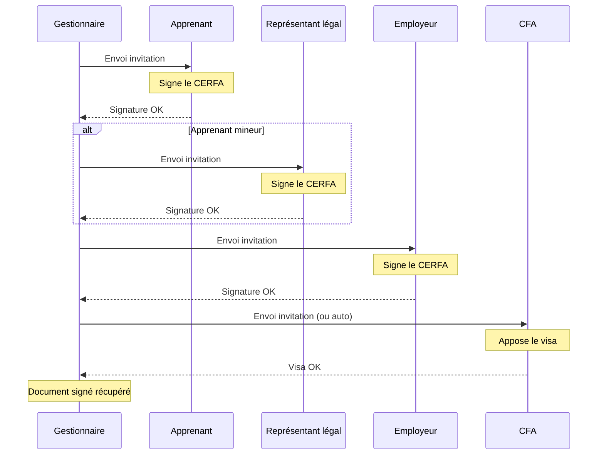

# Tutoriel : Signer un CERFA FA13

Ce tutoriel vous guide pas-à-pas dans le processus complet de signature électronique d'un CERFA FA13 (contrat d'apprentissage) via DocuSeal.

## Prérequis

Avant de commencer, vérifiez que :

- Le contrat d'apprentissage est créé et complet dans Papaours
- Le CERFA FA13 a été généré depuis le contrat
- Les adresses email des signataires sont renseignées dans les fiches correspondantes

## Les signataires du CERFA FA13

Le template CERFA FA13 définit automatiquement les signataires suivants :

| Signataire | Type | Profil | Obligatoire |
|------------|------|--------|-------------|
| **Apprenant** | Personne physique | Apprenant | Oui |
| **Représentant légal** | Personne physique | Représentant légal | Si mineur |
| **Employeur** | Personne physique | Employeur | Oui |
| **CFA** | Personne morale (Visa) | Visa CFA | Oui |

L'ordre de signature par défaut est **séquentiel** :
1. Apprenant
2. Représentant légal (si l'apprenant est mineur)
3. Employeur
4. CFA (visa)

> Si l'apprenant est majeur, l'étape du représentant légal est automatiquement ignorée.

## Étape 1 : Accéder au contrat

<!-- TODO: Screenshot - Navigation menu vers Contrats -->

1. Depuis le menu principal, accédez à **Contrats**
2. Recherchez le contrat concerné (par nom d'apprenant, employeur, etc.)
3. Cliquez sur le contrat pour accéder à son détail

<!-- TODO: Screenshot - Liste des contrats avec recherche -->

## Étape 2 : Accéder au CERFA généré

<!-- TODO: Screenshot - Page détail contrat avec onglet Documents -->

1. Dans le détail du contrat, accédez à l'onglet **Documents**
2. Repérez le CERFA FA13 dans la liste des documents
3. Cliquez sur le document pour voir son détail

<!-- TODO: Screenshot - Onglet documents avec CERFA visible -->

## Étape 3 : Vérifier le document

Avant d'envoyer en signature, vérifiez que le CERFA est complet :

<!-- TODO: Screenshot - Aperçu du CERFA FA13 -->

1. Cliquez sur **Voir les documents** pour prévisualiser le CERFA
2. Vérifiez que toutes les informations sont correctes
3. Si des corrections sont nécessaires, modifiez le contrat et régénérez le CERFA

## Étape 4 : Envoyer en signature électronique

<!-- TODO: Screenshot - Bouton Envoyer en signature sur la page du document -->

1. Depuis la page du document CERFA, cliquez sur **Envoyer en signature**

<!-- TODO: Screenshot - Récapitulatif des signataires avant envoi -->

2. Vérifiez la liste des signataires affichée :
   - **Apprenant** : Nom, prénom, email
   - **Représentant légal** : Nom, prénom, email (si apprenant mineur)
   - **Employeur** : Nom, prénom, email
   - **CFA** : Code visa

3. Cliquez sur **Confirmer l'envoi**

<!-- TODO: Screenshot - Message de confirmation envoi réussi -->

La signature passe à l'état **Envoyée en signature**. L'apprenant reçoit immédiatement son invitation.

## Étape 5 : Suivi des signatures

Suivez l'avancement depuis le détail de la signature :

<!-- TODO: Screenshot - Page suivi avec tous les signataires et leurs statuts -->

Le tableau affiche pour chaque signataire :
- Son statut actuel (À envoyer / En attente / Signé / Annulé)
- La date d'envoi de l'invitation
- La date de signature (une fois signé)
- Son ordre dans la séquence

## Étape 6 : Signature par l'apprenant

L'apprenant est le premier à signer.

### Email reçu

<!-- TODO: Screenshot - Email reçu par l'apprenant -->

L'apprenant reçoit un email contenant :
- L'objet du document à signer
- Un bouton/lien pour accéder à la signature

### Interface DocuSeal

<!-- TODO: Screenshot - Interface DocuSeal vue apprenant -->

1. L'apprenant clique sur le lien dans l'email
2. Il accède à l'interface DocuSeal
3. Il consulte le CERFA
4. Il clique sur la zone de signature prévue
5. Il dessine ou tape sa signature
6. Il valide

<!-- TODO: Vidéo - Parcours complet signature apprenant -->
<video controls>
  <source src="/videos/signature/tuto-signature-apprenant.webm" type="video/webm" />
  <source src="/videos/signature/tuto-signature-apprenant.mp4" type="video/mp4" />
  Votre navigateur ne supporte pas la lecture de vidéos.
</video>

### Après signature

- Le statut de l'apprenant passe à **Signé**
- L'état global passe à **En cours de signature**
- Le signataire suivant reçoit son invitation

## Étape 7 : Signature par le représentant légal (si mineur)

Si l'apprenant est mineur, le représentant légal est sollicité après l'apprenant.

<!-- TODO: Screenshot - Email reçu par le représentant légal -->

Le processus est identique :
1. Réception de l'email avec lien
2. Consultation du document dans DocuSeal
3. Apposition de la signature
4. Validation

> Si l'apprenant est majeur, cette étape est automatiquement ignorée et l'employeur reçoit directement l'invitation.

## Étape 8 : Signature par l'employeur

Après la signature de l'apprenant (et du représentant légal si applicable), l'employeur reçoit son invitation.

<!-- TODO: Screenshot - Email reçu par l'employeur -->

<!-- TODO: Screenshot - Interface DocuSeal vue employeur -->

Le processus est identique aux étapes précédentes.

## Étape 9 : Visa du CFA

En dernier, le CFA appose son visa sur le document. Le comportement dépend du mode configuré lors du [paramétrage du visa](04-parametrage-visa) du Centre de formation.

### Visa automatique

Si le visa est configuré en mode **Automatique**, le tampon est apposé sans intervention dès que l'employeur a signé.

### Visa avec validation par courriel

Si le visa est configuré en mode **Validation par courriel** :

<!-- TODO: Screenshot - Email reçu par le responsable CFA -->

1. Le responsable CFA reçoit une notification
2. Il accède à l'interface de validation
3. Il vérifie le document
4. Il valide l'apposition du visa (tampon/cachet)

<!-- TODO: Screenshot - Interface validation visa CFA -->

<!-- TODO: Vidéo - Validation visa CFA -->
<video controls>
  <source src="/videos/signature/tuto-visa-cfa.webm" type="video/webm" />
  <source src="/videos/signature/tuto-visa-cfa.mp4" type="video/mp4" />
  Votre navigateur ne supporte pas la lecture de vidéos.
</video>

## Étape 10 : Récupération du document signé

Une fois toutes les signatures et le visa apposés :

<!-- TODO: Screenshot - Signature à l'état Signée -->

1. L'état passe à **Signée**
2. Le document signé est automatiquement récupéré dans Papaours
3. Tous les signataires reçoivent une copie par email

### Accéder au document signé

<!-- TODO: Screenshot - Bouton voir documents avec document signé disponible -->

1. Accédez au détail de la signature
2. Cliquez sur **Voir les documents**
3. Le document signé est disponible au téléchargement

Le PDF signé contient :
- Le CERFA avec toutes les signatures
- Le visa/tampon du CFA
- Le certificat de signature électronique

## Récapitulatif du processus

## Cas particuliers

### Annuler la signature en cours

Si vous devez annuler la signature (erreur dans le document, changement de situation, etc.) :

<!-- TODO: Screenshot - Annulation d'une signature CERFA en cours -->

1. Accédez au détail de la signature
2. Cliquez sur **Annuler**
3. Confirmez l'annulation

Les signataires ayant déjà signé sont notifiés de l'annulation.

Pour relancer le processus :
1. Corrigez le contrat si nécessaire
2. Régénérez le CERFA
3. Créez une nouvelle signature

