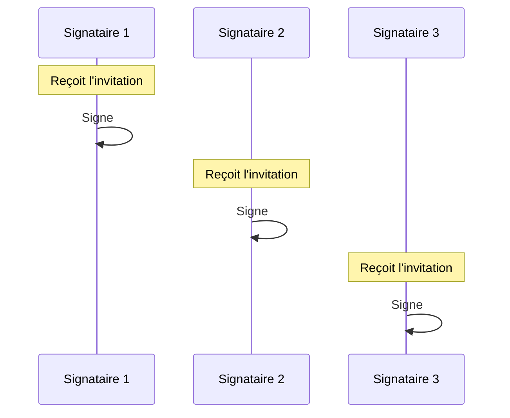
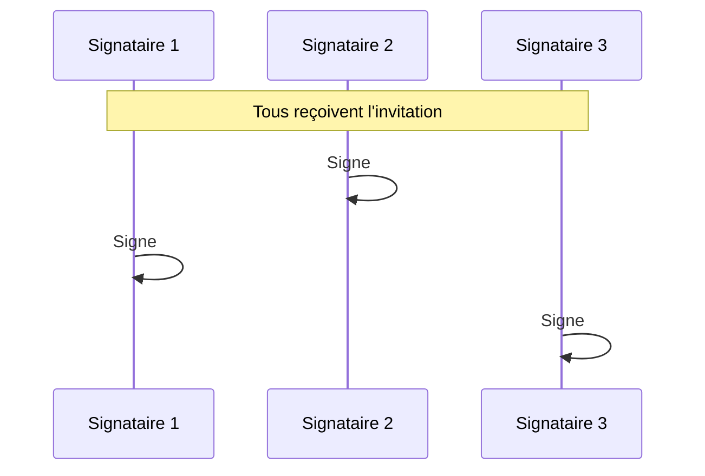

# Signature électronique

La signature électronique permet de faire signer des documents de manière dématérialisée via la plateforme **DocuSeal**. Les signataires reçoivent une invitation par email et signent directement en ligne.

> La signature électronique est disponible **uniquement pour les documents générés à partir de templates**.

## Principe de fonctionnement

1. **Génération** : Un document est généré depuis un template, les signataires sont définis automatiquement par le template
2. **Envoi** : Vous envoyez la signature, chaque signataire reçoit une invitation par email
3. **Signature en ligne** : Les signataires accèdent à DocuSeal et signent électroniquement
4. **Récupération** : Le document signé est automatiquement récupéré dans l'application

## Signataires

### Définition automatique

Pour les documents générés, **les signataires sont définis automatiquement par le template** lors de la génération. Vous n'avez pas à les saisir manuellement.

Le template définit :
- Les signataires requis (personnes physiques et/ou morales)
- Le positionnement de chaque signature sur le document (coordonnées X, Y, page)

## Ordonnancement

L'ordre de signature n'est **pas défini par le template**. Vous pouvez le configurer et le modifier à tout moment via l'écran de modification de la signature, que le document soit généré ou non.

Deux modes d'ordonnancement sont disponibles :

### Séquentiel

Les signataires signent **dans un ordre défini**. Chaque signataire ne reçoit son invitation qu'après la signature du précédent.

### Sans ordonnancement

Tous les signataires reçoivent leur invitation **simultanément** et peuvent signer dans n'importe quel ordre.

## Envoyer en signature

### Prérequis

Avant d'envoyer une signature électronique, assurez-vous que :
- Le document est généré (état "Disponible")
- Tous les signataires ont une adresse email valide
- Le positionnement des signatures est défini

### Procédure

1. Accédez au document généré
2. Cliquez sur **Envoyer en signature**
3. Vérifiez les informations des signataires
4. Confirmez l'envoi

La signature passe à l'état **Envoyée en signature** et les invitations sont envoyées selon le mode d'ordonnancement configuré.

## Parcours du signataire

Chaque signataire :

1. Reçoit un email contenant un lien sécurisé vers DocuSeal
2. Accède à l'interface DocuSeal
3. Consulte le document
4. Clique sur les zones de signature prévues
5. Appose sa signature (dessin, saisie ou upload)
6. Confirme et valide
7. Reçoit un email de confirmation

## Visa (personne morale)

Pour les personnes morales (organisations), deux modes de signature existent :

| Mode | Description |
|------|-------------|
| **Automatique** | Le tampon est apposé automatiquement sans intervention |
| **Validation par courriel** | Un responsable reçoit un email et doit valider l'apposition |

Le mode est configuré lors du [paramétrage du visa](05-parametrage-visa) sur l'entité concernée (Centre de formation, Unité de formation, Employeur).

> Si aucun visa n'est paramétré sur l'entité, il n'y aura pas de signataire moral sur la signature.

## Suivi du processus

### Détail de la signature

La page de détail (identique à la signature manuelle) affiche l'état de chaque signataire :

| Colonne | Description |
|---------|-------------|
| Signataire | Nom, email (ou code visa) |
| Type/Profil | Personne physique + profil / Visa auto ou manuel |
| État | À envoyer / En attente / Signé / Annulé |
| Date d'envoi | Date d'envoi de l'invitation |
| Date du dernier état | Dernière mise à jour du statut |
| Date de signature | Date et heure de signature |
| Ordre | Position dans l'ordonnancement (si séquentiel) |

### Progression des états

| État global | Signification |
|-------------|---------------|
| **Envoyée en signature** | Invitations envoyées, aucune signature reçue |
| **En cours de signature** | Au moins un signataire a signé |
| **Signée** | Tous les signataires ont signé |

## Récupération du document signé

Une fois tous les signataires ayant signé, le document signé est **automatiquement récupéré** depuis DocuSeal et stocké dans l'application.

Le document signé contient :
- Toutes les signatures électroniques apposées
- Le certificat de signature (preuve légale)
- L'horodatage de chaque signature

Accédez au document signé via le bouton **Voir les documents** dans le détail de la signature.

## Annuler une signature

Vous pouvez annuler une signature électronique en cours tant qu'elle n'est pas terminée.

1. Accédez au détail de la signature
2. Cliquez sur **Annuler**
3. Confirmez l'annulation

**Conséquences :**
- L'état passe à **Annulée**
- Tous les signataires passent au statut "Annulé"
- Les signataires ayant déjà signé voient leur signature invalidée
- La demande dans DocuSeal est annulée

> **Annulation impossible si** la signature est déjà Signée ou Annulée.

## Supprimer une signature

La suppression est possible uniquement si la signature est :
- À l'état **Créée** (jamais envoyée)
- À l'état **Annulée**

> **Attention** : La suppression est **irréversible**.
