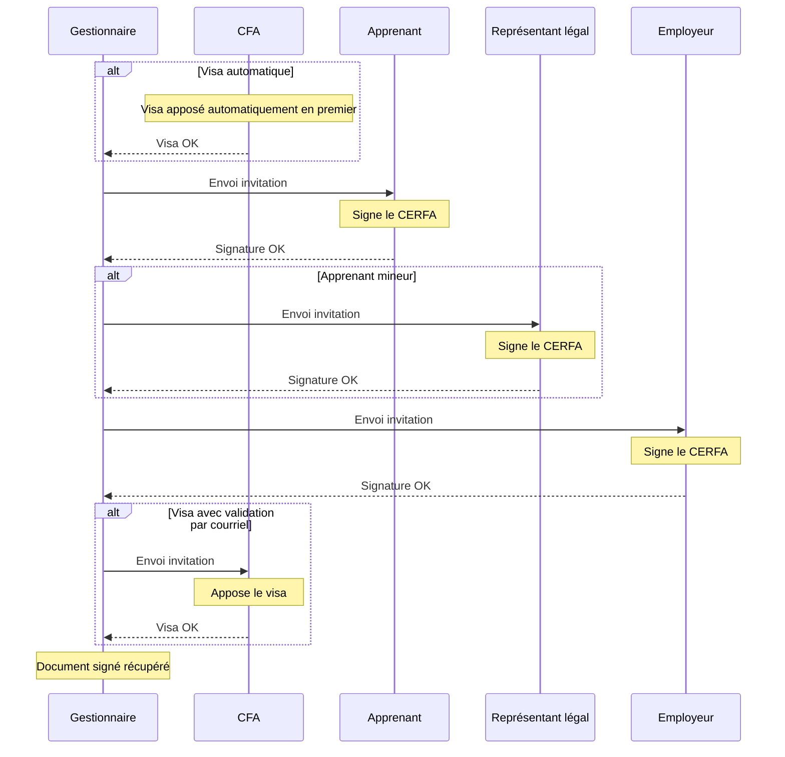

# Tutoriel : Signer un CERFA FA13

Ce tutoriel vous guide pas-à-pas dans le processus complet de signature électronique d'un CERFA FA13 (contrat d'apprentissage) via DocuSeal.

## Prérequis

Avant de commencer, vérifiez que :

- Le contrat d'apprentissage est créé et complet dans Papaours
- Le CERFA FA13 a été généré depuis le contrat
- Les adresses email des signataires sont renseignées dans les fiches correspondantes

## Les signataires du CERFA FA13

Le template CERFA FA13 définit automatiquement les signataires suivants :

| Signataire | Type | Profil | Obligatoire |
|------------|------|--------|-------------|
| **Apprenant** | Personne physique | Apprenant | Oui |
| **Représentant légal** | Personne physique | Représentant légal | Si mineur |
| **Employeur** | Personne physique | Employeur | Oui |
| **CFA** | Personne morale (Visa) | Visa CFA | Oui |

L'ordre de signature par défaut est **séquentiel** :
1. CFA (visa) - si mode automatique, apposé en premier
2. Apprenant
3. Représentant légal (si l'apprenant est mineur)
4. Employeur
5. CFA (visa) - si mode validation par courriel

> Si l'apprenant est majeur, l'étape du représentant légal est automatiquement ignorée.

## Processus complet

La vidéo ci-dessous présente le processus complet de signature d'un CERFA FA13 :

<video controls>
  <source src="https://papaours.s3.fr-par.scw.cloud/documentations/tutoriel/signature/tuto-signature-cerfa-fa13.webm" type="video/webm" />
  <source src="https://papaours.s3.fr-par.scw.cloud/documentations/tutoriel/signature/tuto-signature-cerfa-fa13.mp4" type="video/mp4" />
  Votre navigateur ne supporte pas la lecture de vidéos.
</video>

## Étapes du processus

### 1. Accéder au contrat et au CERFA

1. Depuis le menu principal, accédez à **Contrats**
2. Recherchez et sélectionnez le contrat concerné
3. Dans l'onglet **Documents**, cliquez sur le CERFA FA13

### 2. Envoyer en signature

1. Cliquez sur **Envoyer en signature**
2. Vérifiez la liste des signataires :
   - **Apprenant** : Nom, prénom, email
   - **Représentant légal** : Nom, prénom, email (si apprenant mineur)
   - **Employeur** : Nom, prénom, email
   - **CFA** : Code visa
3. Cliquez sur **Confirmer l'envoi**

La signature passe à l'état **Envoyée en signature**.

### 3. Signatures des parties

Les signataires reçoivent les invitations dans l'ordre séquentiel :

1. **CFA (visa)** - si mode **Automatique** : le tampon est apposé en premier, avant les autres signataires
2. **Apprenant** : reçoit l'invitation, signe dans DocuSeal
3. **Représentant légal** (si mineur) : reçoit l'invitation après l'apprenant
4. **Employeur** : reçoit l'invitation après les signatures précédentes
5. **CFA (visa)** - si mode **Validation par courriel** : le responsable reçoit un email pour valider

> Si l'apprenant est majeur, l'étape du représentant légal est ignorée.

### 4. Récupération du document signé

Une fois toutes les signatures apposées :
- L'état passe à **Signée**
- Le document signé est automatiquement récupéré dans Papaours
- Tous les signataires reçoivent une copie par email

Le PDF signé contient :
- Le CERFA avec toutes les signatures
- Le visa/tampon du CFA
- Le certificat de signature électronique

## Récapitulatif du processus

## Cas particuliers

### Annuler la signature en cours

Si vous devez annuler la signature (erreur dans le document, changement de situation, etc.) :

1. Accédez au détail de la signature
2. Cliquez sur **Annuler**
3. Confirmez l'annulation

Les signataires ayant déjà signé sont notifiés de l'annulation.

Pour relancer le processus :
1. Corrigez le contrat si nécessaire
2. Régénérez le CERFA
3. Créez une nouvelle signature

