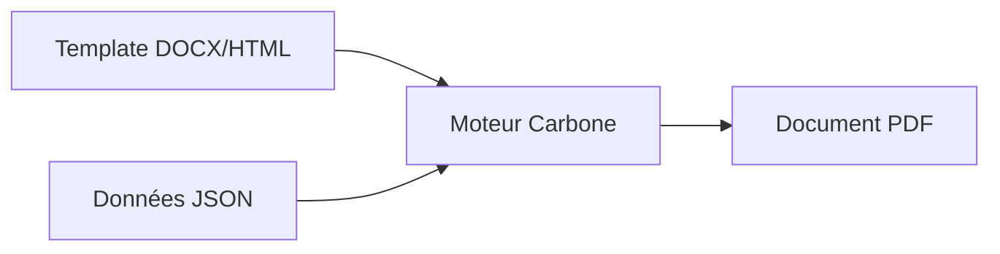

# Templates de document

## Introduction

Papaours intègre un **moteur de génération de documents** permettant de produire automatiquement des documents personnalisés (attestations, courriers, formulaires) à partir des données de l'application.

Un **template** est un modèle de document (Word ou HTML) contenant des **balises de substitution** qui seront remplacées par les données réelles lors de la génération. Par exemple, la balise `{d.apprenant.nom}` sera remplacée par le nom de l'apprenant.

### Fonctionnement

### Deux types de templates

| Type | Description | Exemple |
|------|-------------|---------|
| **Réservés** | Templates système maintenus par Papaours | CERFA FA13, CERFA P2S |
| **Non réservés** | Templates personnalisés créés par votre organisation | Attestations, courriers |

Cette documentation vous accompagne dans la création de vos propres templates.

---

## Comprendre les templates

1. [Types de templates](02-types-templates) - Différence entre templates réservés et non réservés
2. [Créer un template](03-creer-template) - Guide pas-à-pas pour créer un template
3. [Entités liées](04-entites-liees) - Comprendre les entités disponibles

## Données disponibles

4. [Données Apprenant](05-donnees-apprenant) - Variables de substitution pour l'apprenant
5. [Données Employeur](06-donnees-employeur) - Variables de substitution pour l'employeur
6. [Données Contrat](07-donnees-contrat) - Variables de substitution pour le contrat
7. [Données Dossier de formation](08-donnees-dossier-formation) - Variables pour le dossier de formation

## Utilisation

8. [Générer un document](09-generer-document) - Comment générer un document depuis l'application

---

## Syntaxe Carbone

Les templates utilisent la syntaxe **Carbone.io** pour les balises de substitution. Consultez la [documentation Carbone](carbone/index) pour apprendre à :

- [Insérer des données](carbone/substituer/03-les-bases-des-substitutions) avec les balises `{d.xxx}`
- [Formater les données](carbone/formater/index) (dates, nombres, texte)
- [Afficher du contenu conditionnel](carbone/conditionner/index)
- [Répéter du contenu](carbone/tableau/06-repetitions-with-arrays) avec les boucles
