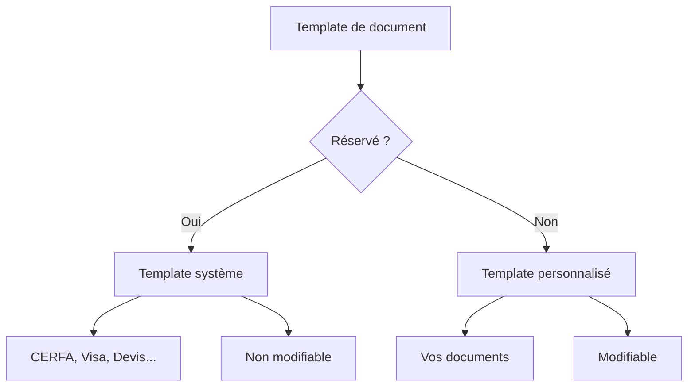

# Types de templates

## Vue d'ensemble

Papaours distingue deux catégories de templates de documents :

| Type | Description | Modifiable | Supprimable |
|------|-------------|------------|-------------|
| **Réservé** | Templates système utilisés par les processus automatiques | Non | Non |
| **Non réservé** | Templates personnalisés créés par les utilisateurs | Oui | Oui |

---

## Templates réservés

Les templates **réservés** sont des modèles fournis et maintenus par Papaours. Ils sont utilisés dans les processus automatiques de l'application.

### Caractéristiques

- Créés et mis à jour par l'équipe Papaours
- Utilisés pour les documents officiels (CERFA, attestations, etc.)
- Non modifiables par les utilisateurs
- Non supprimables

### Exemples de templates réservés

| Code | Intitulé | Entité liée |
|------|----------|-------------|
| `PAPAOURS-CERFA-FA13-14` | CERFA FA13 Contrat d'apprentissage v14 | Contrat |
| `PAPAOURS-CERFA-FA13-13` | CERFA FA13 Contrat d'apprentissage v13 | Contrat |
| `PAPAOURS-CERFA-P2S-3` | CERFA P2S v3 | Dossier de formation |

### Types de documents réservés

Les templates réservés sont associés à des **types de documents** prédéfinis :

| Code type | Intitulé |
|-----------|----------|
| `PAPAOURS-CERFAFA13` | CERFA FA13 Contrat d'apprentissage |
| `PAPAOURS-CERFAP2S` | CERFA P2S |
| `PAPAOURS-RECO-RQTH` | Reconnaissance RQTH |
| `PAPAOURS-SPORTIF-HT-NIV` | Inscription Sportif Haut Niveau |
| `PAPAOURS-APPRENANT-BOE` | Obligation d'emploi (BOE) |
| `PAPAOURS-EQUIVALENCE-JEUNE-RQTH` | Équivalence jeunes RQTH (15 à 20 ans) |
| `PAPAOURS-VISA` | Visa de signature |
| `PAPAOURS-DEVIS` | Devis |

---

## Templates non réservés

Les templates **non réservés** sont des modèles personnalisés que vous pouvez créer pour répondre à vos besoins spécifiques.

### Caractéristiques

- Créés par les utilisateurs de votre organisation
- Associés à un type de document (réservé ou personnalisé)
- Modifiables et supprimables
- Utilisent les mêmes données que les templates réservés

### Cas d'usage

- Attestations de formation personnalisées
- Courriers types
- Documents internes
- Conventions spécifiques

---

## Comparatif

---

## Pour aller plus loin

-> [02 - Créer un template](02-creer-template)
