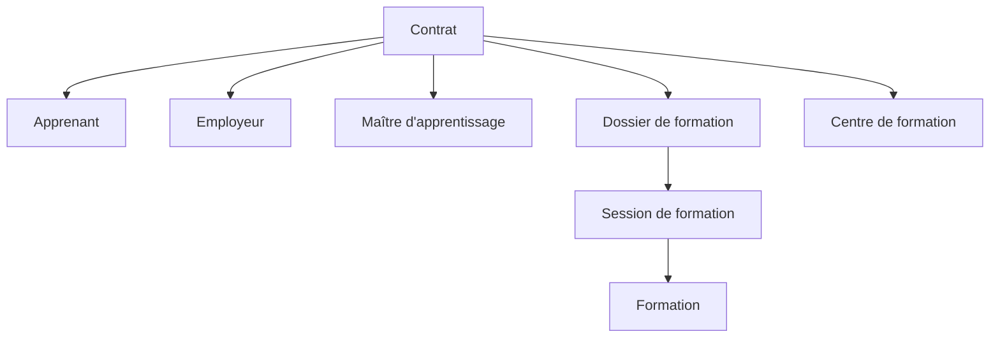

# Entités liées

## Principe

Lors de la création d'un template, vous devez sélectionner une ou plusieurs **entités liées**. Ce choix détermine :

- Les **données accessibles** dans le template via les balises `{d.xxx}`
- Le **contexte de génération** du document (depuis quelle fiche le document peut être généré)

---

## Entités disponibles

Papaours propose les entités suivantes :

| Entité | Code | Description |
|--------|------|-------------|
| **Contrat** | `CONTRAT` | Contrat d'apprentissage avec toutes ses données liées |
| **Apprenant** | `APPRENANT` | Fiche de l'apprenant |
| **Employeur** | `EMPLOYEUR` | Fiche de l'employeur |
| **Dossier de formation** | `DOSSIER_FORMATION` | Dossier d'inscription à une formation |
| **Centre de formation** | `CENTRE_DE_FORMATION` | Données du CFA |

---

## Contenu de chaque entité

### Contrat (`CONTRAT`)

L'entité Contrat est la plus riche car elle agrège les données de plusieurs sources :

**Données incluses :**
- Informations contractuelles (dates, type, durée)
- Données de l'apprenant
- Données de l'employeur et du maître d'apprentissage
- Données de la formation et de la session
- Données du CFA

### Apprenant (`APPRENANT`)

**Données incluses :**
- Identité (nom, prénom, date de naissance, NIR)
- Coordonnées (adresse, téléphone, courriel)
- Besoins spécifiques (RQTH, sportif haut niveau)
- Représentant légal (si mineur)

### Employeur (`EMPLOYEUR`)

**Données incluses :**
- Identification (SIRET, dénomination sociale)
- Adresse du siège et de l'établissement
- Activité (code NAF, effectif)
- Convention collective
- Coordonnées

### Dossier de formation (`DOSSIER_FORMATION`)

**Données incluses :**
- Informations du dossier (code, état)
- Session de formation
- Formation (intitulé, RNCP, diplôme)
- Lieux de formation

### Centre de formation (`CENTRE_DE_FORMATION`)

**Données incluses :**
- Identification (SIRET, UAI)
- Dénomination
- Adresse
- Coordonnées

---

## Combinaisons d'entités

Certains templates peuvent nécessiter plusieurs entités liées. Par exemple :

| Template | Entités liées |
|----------|---------------|
| CERFA FA13 | `CONTRAT` |
| CERFA P2S | `DOSSIER_FORMATION`, `CENTRE_DE_FORMATION` |
| Attestation personnalisée | `APPRENANT`, `DOSSIER_FORMATION` |

> Lorsque plusieurs entités sont liées, les données sont accessibles via leur préfixe respectif dans le JSON.

---

## Pour aller plus loin

Les pages suivantes détaillent les variables disponibles pour chaque entité :

-> [04 - Données Apprenant](04-donnees-apprenant)
