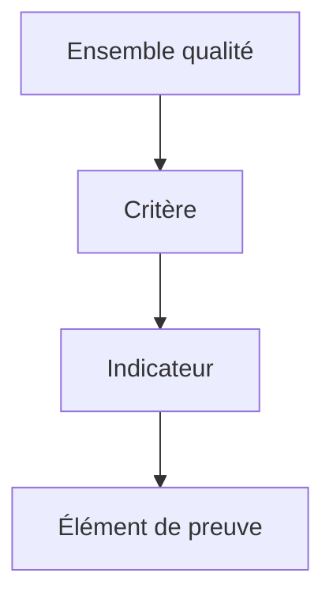

## Hiérarchie qualité

Le module Qualité repose sur une structure hiérarchique à quatre niveaux :

| Niveau | Description | Exemple |
|---|---|---|
| **Ensemble qualité** | Conteneur principal regroupant les critères d'un référentiel | Qualiopi v1 |
| **Critère** | Exigence à évaluer au sein d'un ensemble | Critère 1 — Conditions d'information |
| **Indicateur** | Point d'évaluation mesurable rattaché à un critère | Indicateur 1.1 — Diffusion de l'offre |
| **Élément de preuve** | Preuve attendue pour un indicateur (document ou donnée) | Catalogue de formations publié |

Chaque niveau est rattaché au niveau supérieur : un critère appartient à un ensemble, un indicateur appartient à un critère, un élément de preuve appartient à un indicateur.

## Codes auto-générés

Chaque entité reçoit un code unique généré automatiquement à la création. Ce code est **non modifiable** et suit un format standardisé.

| Entité | Préfixe | Format complet | Exemple |
|---|---|---|---|
| Ensemble qualité | `ESQ` | `ESQ<AAAA>-<NNNNNN>` | `ESQ2026-000001` |
| Critère | `CRT` | `CRT<AAAA>-<NNNNNN>` | `CRT2026-000001` |
| Indicateur | `IND` | `IND<AAAA>-<NNNNNN>` | `IND2026-000001` |

- **AAAA** : année de création.
- **NNNNNN** : index incrémental sur 6 positions, remis à zéro chaque année.

## Cycle de vie des statuts

Les ensembles qualité, critères et indicateurs partagent le même cycle de vie en deux statuts :

| Statut | Description |
|---|---|
| **Activé** | L'entité est utilisable dans la démarche qualité |
| **Désactivé** | L'entité est temporairement non utilisable |

À la création, le statut est **Activé** par défaut.

## Types d'éléments de preuve

Les éléments de preuve se déclinent en deux types :

| Type | Description | Source possible |
|---|---|---|
| **Document** | Un document attendu pour prouver la conformité | Indicateur ou Objet métier |
| **Donnée** | Une donnée applicative exploitée comme preuve | Objet métier uniquement |

### Élément de preuve de type Document

Un document attendu peut être recherché depuis deux sources :

- **Source Indicateur** : le document est directement rattaché à l'indicateur.
- **Source Objet métier** : le document est recherché sur chaque instance d'un objet métier (par exemple, chaque apprenant).

### Élément de preuve de type Donnée

Une donnée correspond à un attribut ou une valeur calculée d'un objet métier de l'application (par exemple, la date de naissance d'un apprenant ou le taux de réussite d'une action de formation).

## Règles de dates

Les dates d'application suivent des règles de cohérence entre les niveaux de la hiérarchie.

### Bornes inclusives

Toutes les périodes d'application utilisent des **bornes inclusives** : `[date début ; date fin]`. La date de début et la date de fin font partie de la période.

### Contraintes parent/enfant

| Entité enfant | Contrainte |
|---|---|
| **Critère** | Sa période d'application doit être incluse dans celle de l'ensemble qualité parent |
| **Indicateur** | Sa période d'application doit être incluse dans celle du critère parent |

### Héritage des dates

- À la création d'un **critère**, les dates sont initialisées avec celles de l'ensemble qualité parent.
- À la création d'un **indicateur**, les dates sont initialisées avec celles du critère parent.
- L'utilisateur peut modifier ces dates, à condition de respecter les contraintes d'inclusion.

### Non-chevauchement des périodes

Les ensembles qualité ne peuvent pas avoir de périodes d'application qui se chevauchent. Deux ensembles ne peuvent pas partager un jour commun en raison des bornes inclusives.

## Volumétrie et acceptation

Les éléments de preuve définissent une volumétrie attendue, exprimée de deux manières mutuellement exclusives :

| Mode | Description | Valeur par défaut |
|---|---|---|
| **Taux attendu** | Pourcentage entier entre 0 et 100 | 100 % |
| **Nombre attendu** | Entier strictement positif | — |

Un taux de 100 % signifie qu'une preuve est attendue pour chaque instance de la source.

## Pour aller plus loin

- [Gérer les ensembles qualité](03-gerer-ensembles-qualite) : créer et administrer vos référentiels qualité.
