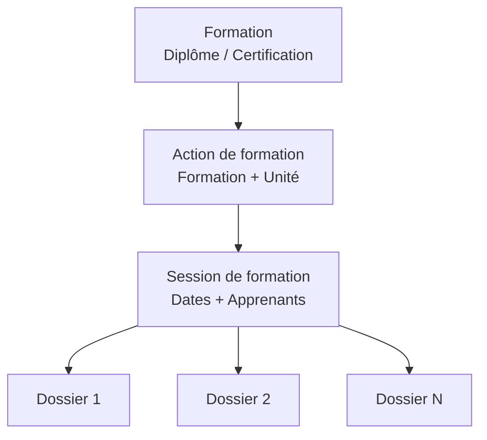

# Introduction aux sessions de formation

## Qu'est-ce qu'une session de formation ?

Une **session de formation** est le niveau opérationnel de la hiérarchie pédagogique. Elle représente une période de formation concrète, avec des dates précises et des apprenants inscrits.

## Position dans la hiérarchie

La session de formation est le dernier niveau de la chaîne :
- Elle dépend d'une **action de formation** (et donc d'une formation et d'une unité)
- Elle regroupe les **dossiers de formation** des apprenants inscrits

## Pourquoi ce niveau ?

La session de formation permet de :

- **Planifier** des périodes de formation avec des dates précises
- **Regrouper** les apprenants d'une même promotion
- **Suivre** le remplissage et la capacité
- **Organiser** le calendrier pédagogique

## Public concerné

Cette documentation s'adresse aux :

- **Responsables pédagogiques** : création et suivi des sessions
- **Administrateurs de centre** : approbation des sessions
- **Gestionnaires de formation** : inscription des apprenants

## Fonctionnalités principales

| Fonctionnalité | Description |
|----------------|-------------|
| **Création** | Définir une session avec dates et capacité |
| **Consultation** | Voir le détail et les apprenants inscrits |
| **Modification** | Mettre à jour les paramètres |
| **Approbation** | Valider la session avant utilisation |
| **Inscriptions** | Rattacher des dossiers de formation |

---

## Pour aller plus loin

-> [02 - Concepts clés](02-concepts-cles)
