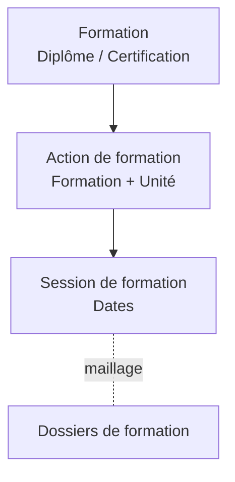

# Introduction aux sessions de formation

## Qu'est-ce qu'une session de formation ?

Une **session de formation** est le niveau opérationnel de la hiérarchie pédagogique. Elle représente une période de formation concrète, avec des dates précises.

## Position dans la hiérarchie

La session de formation est le dernier niveau de la chaîne pédagogique :
- Elle dépend d'une **action de formation** (et donc d'une formation et d'une unité)
- Elle est liée aux **dossiers de formation** via un maillage (les apprenants sont rattachés via leur dossier)

## Pourquoi ce niveau ?

La session de formation permet de :

- **Planifier** des périodes de formation avec des dates précises
- **Regrouper** les dossiers de formation d'une même promotion
- **Organiser** le calendrier pédagogique

## Public concerné

Cette documentation s'adresse aux :

- **Responsables pédagogiques** : création et suivi des sessions
- **Gestionnaires de formation** : maillage avec les dossiers de formation

## Fonctionnalités principales

| Fonctionnalité | Description |
|----------------|-------------|
| **Création** | Définir une session avec des dates |
| **Consultation** | Voir le détail de la session |
| **Modification** | Mettre à jour les paramètres |
| **Maillage** | Lier des dossiers de formation à la session |

---

## Pour aller plus loin

-> [02 - Concepts clés](02-concepts-cles)
