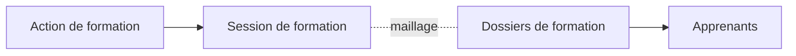

# Concepts clés

## Définitions

### Session de formation

Une **session de formation** est une période programmée pendant laquelle une action de formation est dispensée. Elle est caractérisée par des dates de début et de fin.

### Relation avec les autres entités

La session ne contient pas directement les apprenants. C'est le **maillage** entre la session et les dossiers de formation qui permet de rattacher les apprenants à une session.

## Éléments constitutifs

Une session de formation comprend :

| Élément | Description |
|---------|-------------|
| **Action de formation** | L'action dont découle la session |
| **Date de début** | Premier jour de la formation |
| **Date de fin** | Dernier jour de la formation |

## Maillage avec les dossiers de formation

Le lien entre une session et les apprenants se fait via les **dossiers de formation** :

- Un dossier de formation peut être maillé à une session
- Ce maillage permet de constituer une "promotion"
- Les apprenants ne sont pas directement dans la session

## Cas d'usage

### Exemple concret

- **Action de formation** : BTS CG dispensé par le Lycée Jean Moulin
- **Session** : Promotion 2024-2026
  - Date de début : 02/09/2024
  - Date de fin : 30/06/2026
  - Dossiers maillés : 22 dossiers de formation

## Périodes de chevauchement

Plusieurs sessions d'une même action de formation peuvent coexister :

- Session 2023-2025 (en cours)
- Session 2024-2026 (en cours)
- Session 2025-2027 (à venir)

---

## Pour aller plus loin

-> [03 - Accéder à la gestion des sessions](03-acceder-gestion-sessions)
