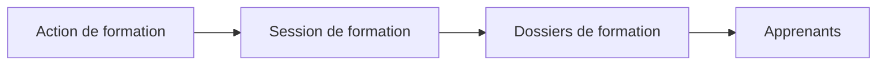

# Concepts clés

## Définitions

### Session de formation

Une **session de formation** est une période programmée pendant laquelle une action de formation est dispensée à un groupe d'apprenants. Elle est caractérisée par des dates de début et de fin, et une capacité d'accueil.

### Relation avec les autres entités

## Éléments constitutifs

Une session de formation comprend :

| Élément | Description |
|---------|-------------|
| **Action de formation** | L'action dont découle la session |
| **Date de début** | Premier jour de la formation |
| **Date de fin** | Dernier jour de la formation |
| **Capacité** | Nombre maximum d'apprenants |
| **Apprenants** | Dossiers de formation rattachés |

## Statuts d'une session de formation

| Statut | Description |
|--------|-------------|
| **À approuver** | En attente de validation |
| **Approuvée** | Validée et ouverte aux inscriptions |
| **En cours** | Période de formation démarrée |
| **Terminée** | Formation achevée |
| **Annulée** | Session annulée |

## Capacité et remplissage

### Gestion de la capacité

- **Capacité** : nombre maximum d'apprenants pouvant être inscrits
- **Inscrits** : nombre de dossiers rattachés à la session
- **Places disponibles** : capacité - inscrits

### Indicateurs visuels

Le taux de remplissage est affiché pour chaque session :

| Taux | Indicateur |
|------|------------|
| < 50% | Faible remplissage |
| 50-80% | Remplissage modéré |
| > 80% | Remplissage élevé |
| 100% | Complet |

## Cas d'usage

### Exemple concret

- **Action de formation** : BTS CG dispensé par le CFA Paris Centre
- **Session** : Promotion 2024-2026
  - Date de début : 02/09/2024
  - Date de fin : 30/06/2026
  - Capacité : 25 apprenants
  - Inscrits : 22 apprenants

## Périodes de chevauchement

Plusieurs sessions d'une même action de formation peuvent coexister :

- Session 2023-2025 (en cours)
- Session 2024-2026 (en cours)
- Session 2025-2027 (à venir)

---

## Pour aller plus loin

-> [03 - Accéder à la gestion des sessions](03-acceder-gestion-sessions)
