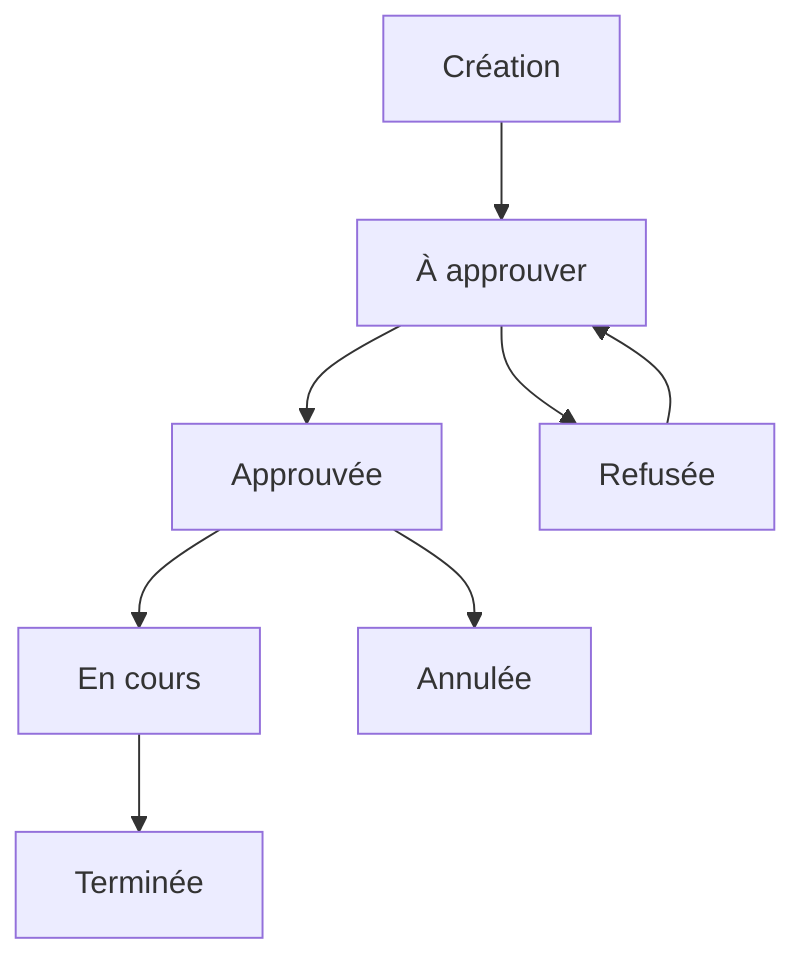

# Processus d'approbation des sessions de formation

## Principe

Le processus d'approbation garantit que toutes les sessions de formation sont validées avant d'être utilisées. Une session non approuvée ne permet pas d'inscrire des apprenants.

## Quand l'approbation est-elle requise ?

L'approbation est nécessaire dans les cas suivants :

- **Création d'une session** : toute nouvelle session de formation
- **Pré-alimentation** : sessions détectées lors de l'onboarding

## Statuts d'approbation

| Statut | Description | Actions possibles |
|--------|-------------|-------------------|
| **À approuver** | En attente de validation | Approuver, Refuser |
| **Approuvée** | Validée et ouverte aux inscriptions | Modifier, Annuler |
| **Refusée** | Non conforme | Corriger et resoumettre |

## Accéder aux sessions à approuver

### Depuis la liste des sessions

1. Menu **Formations** > **Sessions de formation**
2. Utilisez le filtre **Statut** et sélectionnez **À approuver**
3. La liste affiche les sessions en attente

### Indicateur visuel

Les sessions à approuver sont identifiables par un badge de statut spécifique.

## Approuver une session de formation

### Procédure

1. Accédez à la fiche de la session
2. Vérifiez les informations :
   - Action de formation valide et approuvée
   - Dates cohérentes
   - Capacité définie
3. Cliquez sur **Approuver**
4. Confirmez l'approbation

### Éléments à vérifier

Avant d'approuver, contrôlez :

| Élément | Point de vérification |
|---------|----------------------|
| **Action de formation** | Approuvée et active |
| **Dates** | Cohérentes avec le calendrier |
| **Capacité** | Adaptée aux besoins |
| **Intitulé** | Clair et identifiable |

## Refuser une session de formation

Si une session n'est pas conforme :

1. Accédez à la fiche de la session
2. Cliquez sur **Refuser**
3. Indiquez le motif du refus (recommandé)
4. Confirmez le refus

La session reste visible mais ne peut pas être utilisée.

## Pré-alimentation automatique

### Détection des sessions

Lors de l'onboarding ou de synchronisations, Papaours peut détecter automatiquement des sessions de formation à partir des données existantes.

Ces sessions sont créées avec le statut **À approuver** pour validation.

### Vérification recommandée

Pour les sessions pré-alimentées, vérifiez particulièrement :

- La cohérence des dates
- Le rattachement à la bonne action de formation
- L'absence de doublon avec des sessions existantes

## Impact sur les autres modules

Une session de formation non approuvée ne peut pas être utilisée pour :

- **Rattacher des dossiers de formation**
- **Inscrire des apprenants**
- **Apparaître dans les plannings**

## Bonnes pratiques

- **Vérifiez régulièrement** les sessions en attente d'approbation
- **Approuvez en amont** pour permettre les inscriptions dans les délais
- **Documentez les refus** pour faciliter les corrections
- **Coordonnez** avec les responsables pédagogiques

## Cycle de vie complet

---

## Pour aller plus loin

Consultez également :
- [Approbation des formations](../formation/05-processus-approbation)
- [Approbation des actions de formation](../action-formation/06-processus-approbation)
- [Approbation des unités de formation](../unite-formation/08-processus-approbation)
