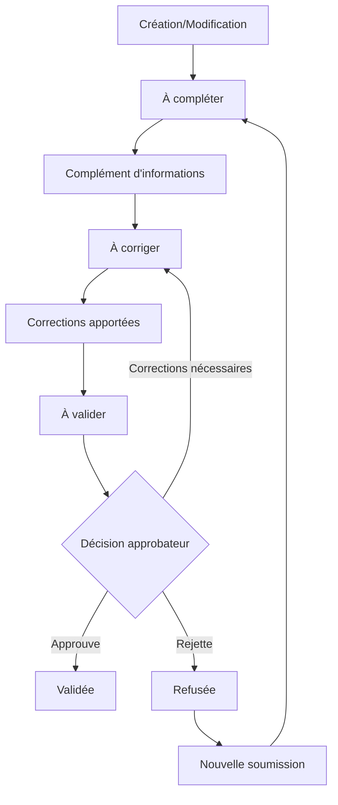

### Table des matières
1. [Principe du processus d'approbation](#principe-du-processus-dapprobation)
2. [États et workflow](#états-et-workflow)
3. [Accéder au module d'approbation](#accéder-au-module-dapprobation)
4. [Traitement des approbations individuelles](#traitement-des-approbations-individuelles)
5. [Approbations par lot](#approbations-par-lot)
6. [Gestion des rejets et corrections](#gestion-des-rejets-et-corrections)
7. [Suivi et reporting](#suivi-et-reporting)

---

## Principe du processus d'approbation

### Objectif
Le processus d'approbation garantit la qualité et la conformité des unités de formation avant leur mise en service. Il permet un contrôle qualité systématique et une validation métier des informations saisies.

### Acteurs du processus

**Créateurs/Modificateurs**
- **Gestionnaires de formation** : Saisie initiale des unités
- **Administrateurs fonctionnels** : Modifications et corrections
- **Utilisateurs métier** : Compléments d'informations

**Approbateurs**
- **Responsables qualité** : Validation des conformités
- **Administrateurs système** : Contrôle technique
- **Référents métier** : Validation fonctionnelle

### Déclenchement
L'approbation est requise dans les cas suivants :
- **Création** d'une nouvelle unité de formation
- **Modification majeure** d'une unité existante
- **Changement de statut** critique (réactivation)
- **Demande explicite** d'un gestionnaire

---

## États et workflow

### États d'approbation

**À compléter**
- **Données insuffisantes** : Champs obligatoires manquants
- **Informations incomplètes** : Détails nécessaires absents
- **Documentation manquante** : Pièces justificatives non fournies

**À corriger**
- **Erreurs détectées** : Incohérences dans les données
- **Format incorrect** : Non-respect des contraintes
- **Informations contradictoires** : Conflits entre champs

**À valider**
- **Données complètes** : Tous les champs requis renseignés
- **Conformité technique** : Formats respectés
- **Prêt pour validation** : En attente d'approbation finale

**Validée**
- **Approbation accordée** : Unité validée par un approbateur
- **Mise en service** : Activation automatique de l'unité
- **Intégration complète** : Disponible dans tous les modules

**Refusée**
- **Non-conformité majeure** : Problèmes bloquants identifiés
- **Critères non respectés** : Standards qualité non atteints
- **Décision de rejet** : Approbation explicitement refusée

### Workflow de traitement

---

## Accéder au module d'approbation

### Navigation principale
Le module d'approbation est accessible via :
- **Menu "Formation"** > **"Unités de Formation"** > **"Approbations"**
- **Onglet "Approbations"** depuis la liste des unités
- **Notifications** directes d'éléments en attente

### Permissions requises
Pour accéder aux approbations :
- **"Consultation des approbations"** : Vue d'ensemble et détails
- **"Approbation des unités de formation"** : Actions de validation/rejet
- **Périmètre approprié** : Accès aux unités concernées

### Vue d'ensemble

**Tableau de bord des approbations**
- **Compteurs par statut** : Nombre d'unités dans chaque état
- **Répartition temporelle** : Évolution des volumes
- **Alertes de délai** : Approbations en retard
- **Assignations** : Répartition par approbateur

**Liste des unités en attente**
Organisation par colonnes :
- **Dénomination** : Nom de l'unité concernée
- **Statut** : État actuel dans le workflow
- **Date de soumission** : Ancienneté de la demande
- **Approbateur assigné** : Responsable du traitement
- **Priorité** : Niveau d'urgence

---

## Traitement des approbations individuelles

### Consultation d'une unité en attente

**Accès au détail**
- Cliquez sur l'unité dans la liste d'approbation
- **Vue spécialisée** avec focus sur les éléments à valider
- **Comparaison** avec la version précédente si modification

**Informations spécifiques**
- **Historique des modifications** : Changements apportés
- **Commentaires** des versions précédentes
- **Points de vigilance** : Éléments nécessitant attention
- **Pièces justificatives** : Documents associés

### Actions d'approbation

**Approuver l'unité**
1. **Vérification complète** : Contrôle de tous les éléments
2. **Validation métier** : Conformité aux standards
3. **Commentaire d'approbation** : Justification de la décision
4. **Confirmation** : Validation définitive

**Demander des corrections**
1. **Identification des problèmes** : Liste détaillée des points
2. **Catégorisation** : Bloquant, Amélioration, Information
3. **Instructions précises** : Explications pour les corrections
4. **Délai de correction** : Temps imparti pour les modifications

**Refuser l'unité**
1. **Motifs de refus** : Raisons détaillées du rejet
2. **Références** : Standards ou règles non respectés
3. **Recommandations** : Pistes d'amélioration pour l'avenir
4. **Confirmation explicite** : Validation du refus définitif

### Outils d'aide à la décision

**Check-list de validation**
- ✅ **Informations légales** : SIRET, dénomination, forme juridique
- ✅ **Données fiscales** : TVA, numéros officiels
- ✅ **Cohérence métier** : Secteur d'activité, formations proposées
- ✅ **Moyens de contact** : Accessibilité et validité
- ✅ **Lieux de formation** : Adresses et capacités réalistes

**Référentiels de contrôle**
- **Base SIRET** : Vérification de l'existence et statut
- **Registres professionnels** : Validité des habilitations
- **Standards qualité** : Conformité aux exigences sectorielles
- **Règles internes** : Respect des procédures de l'organisation

---

## Approbations par lot

### Sélection des unités

**Critères de groupement**
Traitement simultané possible pour :
- **Même type de problème** : Corrections similaires
- **Même créateur** : Unités saisies par la même personne
- **Même période** : Soumissions groupées
- **Même nature** : Organismes du même secteur

**Interface de sélection**
- **Cases à cocher** : Sélection multiple dans la liste
- **Filtres avancés** : Critères de regroupement
- **Aperçu du lot** : Récapitulatif des unités sélectionnées
- **Vérification** : Contrôle de compatibilité

### Actions par lot

**Approbation massive**
- **Pré-contrôles** : Vérification automatique de chaque unité
- **Validation globale** : Commentaire unique pour le lot
- **Traitement séquentiel** : Approbation une par une
- **Rapport de résultats** : Succès et échecs détaillés

**Demande de corrections groupée**
- **Problème commun** : Même type de correction pour toutes
- **Instructions standardisées** : Message uniforme
- **Assignation** : Retour vers les créateurs respectifs
- **Suivi unifié** : Monitoring des corrections

**Rejet par lot**
- **Motifs partagés** : Problèmes similaires identifiés
- **Documentation** : Justifications détaillées
- **Communication** : Notification aux parties prenantes
- **Archivage** : Conservation des décisions

### Gestion des exceptions
Dans un lot, traitement spécifique pour :
- **Unités non conformes** : Exclusion du traitement global
- **Cas particuliers** : Nécessitant une analyse individuelle
- **Problèmes techniques** : Erreurs système lors du traitement
- **Conflits de permissions** : Droits insuffisants sur certaines unités

---

## Gestion des rejets et corrections

### Traitement des unités refusées

**Communication du refus**
- **Notification automatique** : Email au créateur
- **Détail des motifs** : Explications précises des problèmes
- **Références** : Standards et règles applicables
- **Contact** : Coordonnées de l'approbateur pour clarifications

**Options post-refus**
- **Nouvelle soumission** : Correction et resoumission possible
- **Abandon** : Archivage de la demande
- **Escalade** : Remontée vers un niveau supérieur
- **Expertise externe** : Conseil spécialisé si nécessaire

### Corrections demandées

**Notification des corrections**
- **Liste détaillée** : Points à corriger avec priorités
- **Exemples** : Illustrations des bonnes pratiques
- **Délai** : Temps imparti pour les modifications
- **Assistance** : Contact pour aide si nécessaire

**Suivi des corrections**
- **Statut en temps réel** : Avancement des modifications
- **Alertes de délai** : Rappels avant échéance
- **Validation intermédiaire** : Contrôle partiel des corrections
- **Resoumission** : Nouveau cycle d'approbation

### Escalade et résolution de conflits

**Procédure d'escalade**
En cas de désaccord :
1. **Dialogue direct** : Discussion entre créateur et approbateur
2. **Médiation** : Intervention d'un référent métier
3. **Arbitrage** : Décision d'un responsable hiérarchique
4. **Commission** : Examen collégial si nécessaire

**Documentation des décisions**
- **Historique complet** : Toutes les interactions documentées
- **Justifications** : Raisons détaillées de chaque décision
- **Précédents** : Constitution d'une base de référence
- **Amélioration continue** : Évolution des critères

---

## Suivi et reporting

### Métriques d'activité

**Indicateurs de performance**
- **Délai moyen d'approbation** : Temps de traitement par statut
- **Taux d'approbation** : Pourcentage de validations directes
- **Volume mensuel** : Évolution du nombre de demandes
- **Répartition par approbateur** : Charge de travail individuelle

**Tableaux de bord**
- **Vue temps réel** : Situation actuelle des approbations
- **Tendances** : Évolution sur plusieurs mois
- **Comparaisons** : Benchmarks avec périodes précédentes
- **Prévisions** : Charge de travail anticipée

### Rapports de qualité

**Analyse des rejets**
- **Motifs récurrents** : Causes principales de refus
- **Organismes concernés** : Profils des unités rejetées
- **Actions préventives** : Mesures d'amélioration suggérées
- **Formation** : Besoins identifiés pour les créateurs

**Conformité globale**
- **Taux de conformité** : Evolution de la qualité générale
- **Standards respectés** : Niveau d'adhésion aux exigences
- **Points d'amélioration** : Axes de progression identifiés
- **Bonnes pratiques** : Exemples de réussites à diffuser

### Optimisation du processus

**Amélioration continue**
- **Feedback des utilisateurs** : Retours créateurs et approbateurs
- **Simplification** : Réduction des étapes non nécessaires
- **Automatisation** : Contrôles techniques automatisés
- **Formation** : Montée en compétence des acteurs

**Évolution des critères**
- **Adaptation métier** : Prise en compte des évolutions sectorielles
- **Retours terrain** : Intégration de l'expérience utilisateur
- **Conformité réglementaire** : Mise à jour selon la législation
- **Benchmark externe** : Comparaison avec les meilleures pratiques

### Pour aller plus loin
-> [09 - Bonnes pratiques et cas d'usage](09-bonnes-pratiques)